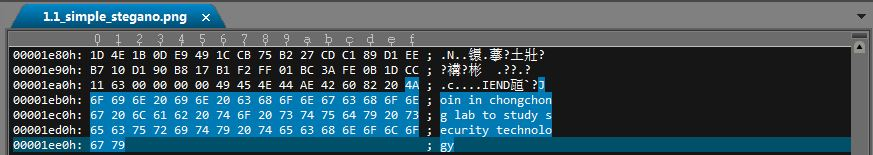
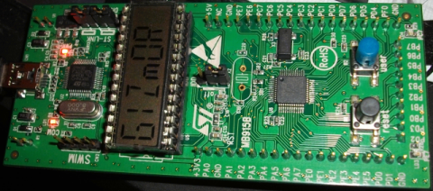
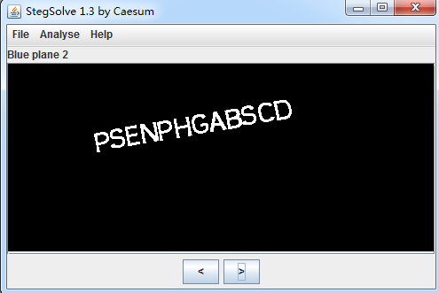
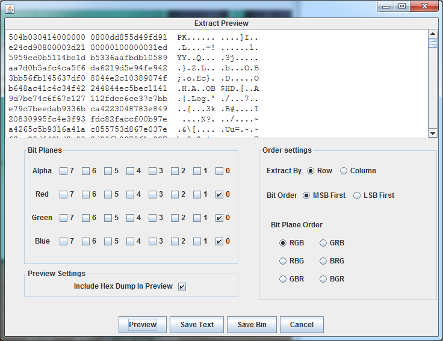
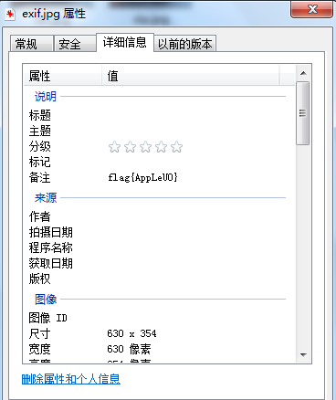
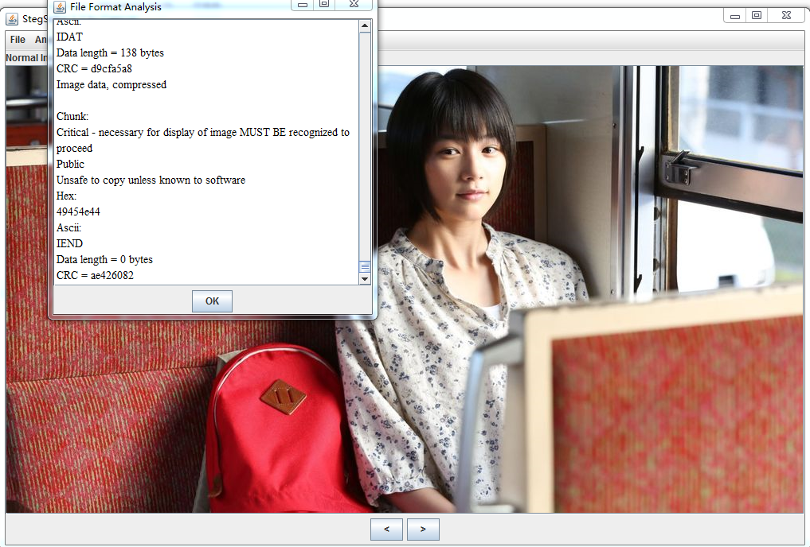
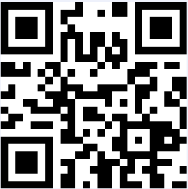

## 1.1 隐写

### 最简单的隐写

我们看到以下图片。这个里面隐藏了什么内容呢？


把这个图片用本文编辑器打开，例如 ultra-edit 或 notepad++后，



我们把看到的图片数据拉到最后看到一句话，出现在png的IEND之后：
`Join in chongchong lab to study security techology`。多么赤果果的广告啊：）这个就是我们图片隐藏的内容，也可以说是最简单的隐写术。

以上隐写的原理是在IEND以及4个字节的校验码后，已经不属于png文件的部分。但因为没有破坏png文件的正常数据，图片仍然可以进行正常显示。
这样的隐写是比较容易的，但也是很容易被破解的。不过广告藏太好了就没人发现啦。

### LSB隐写通道

图片的某一个通道下隐藏了信息

题目https://www.wechall.net/challenge/training/stegano/LSB/index.php， 图片如下：



使用Stegsolve.jar打开图片后，点击下面的箭头切换通道，当切换到Blue Plane 2时，看到了隐藏信息



### LSB隐写最低比特位

对LSB最低比特位的改变不会明显改变图片质量，肉眼无法识别出变化，也是隐藏数据的一种常见手段。

示例：HCTF-2016-Misc


使用Stegsolve.jar打开图片

选择Analyse-->Data Extract，可以指定通道进行提取。



可以发现zip头`504b0304`，用save bin保存为压缩包后，打开运行其中的ELF文件就可以得到最后的flag

### 隐写在可选信息中

图片中，有照相机型号等可选信息，可以用来隐藏信息，例如：


### 载体
题目https://www.wechall.net/challenge/training/stegano/attachment/index.php，

图片如下：


用UltraEdit打开，发现在jpg结束`FFD9`后面有`504B`,说明隐藏了一个zip文件，将此zip文件提取出来后可以看到隐藏信息


可以手动提取出zip的数据，也可以使用如下python代码提取出来保存成`out.zip`

```python
with open("attachment.jpg") as f:
    f.seek(0x4f06)
    r = f.read(0x4f8E - 0x4f06)
    with open("out.zip","wb") as f1:
	    f1.write(r)
```
上面是手动打开UltraEdit发现的，binwalk工具也可以辅助识别结构，推荐linux下使用该工具，我这里演示window的binwalk使用：
```
E:\gitbook\baby-ctf\pic>binwalk.bat 1.1_attachment.jpg
* suggest: you'd better to input the parameters enclosed in double quotes.
* made by pcat

DECIMAL       HEXADECIMAL     DESCRIPTION
--------------------------------------------------------------------------------

0             0x0             JPEG image data, JFIF standard 1.01
20230         0x4F06          Zip archive data, at least v2.0 to extract, compre
ssed size: 14, uncompressed size: 12, name: solution.txt
20344         0x4F78          End of Zip archive, footer length: 22
```

可以看到，在`0x4F06`开始出现了一个zip包，到0x4F78出现zip的结束标记`504B0506`

### 编程辅助
示例：SCTF-2014-MISC400b



赠送福利，给了一张png妹子，一番binwalk和各种检测没有发现明显的异常。在仔细分析png各个块数据后，发现最后一个IDAT有异常，将其扣出用zlib解压，得到625bytes的一串二进制字串。因刚好有625位长，所以想到将其转化为一个25x25的点阵图（二维码）

python代码如下

```python
from PIL import Image
from zlib import *

data = open("fcfc906d-03f6-4db6-b77a-7d2c03829ca5.png", "rb").read()[0x15AFFB:]
data = decompress(data)

print data

img = Image.new('1',(25,25))
d = img.load()

for n,i in enumerate(data):
	d[(n%25,n/25)] = int(i)*255
	
f = open("2.png","wb")
img.save(f)

img = Image.new('1', (25,25))
d = img.load()

for n,i in enumerate(data):
	d[(n%25,n/25)] = (int(i)^1)*255

f = open("3.png","wb")
img.save(f)
```

代码生成的2.png文件和二维码有差异，将其反色后生成的3.png是标准的二维码。



扫一下即可拿到隐写信息： flag：`SCTF{(121.518549,25.040854)}`

### GIF隐写

在GIF图片中的某一帧可以隐藏信息，由于GIF图片播放速度较快，不易于被直接观察出来。
例如GIF图片


可以看到包含Key的文本一闪而过，这里隐藏了信息。

可以使用gif分离器把每一帧分离出来。

我这里继续使用神器Stegsolve.jar，打开图片后选择Analyse-->Frame Browser， 可以在第4帧中看到隐藏信息：`Key: Do passports let you fly interstellar?`


### jpg隐写

TODO

### 音频隐写

TODO