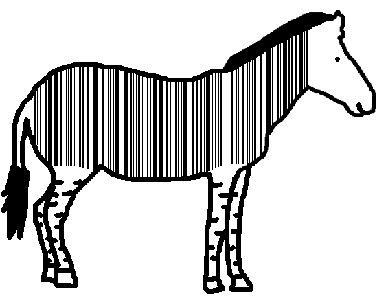
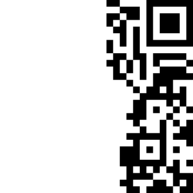
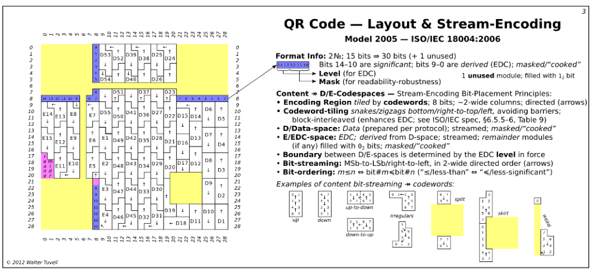
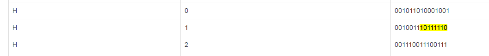
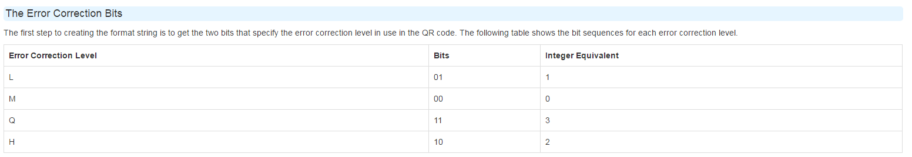
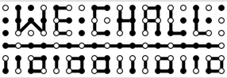

## 1.2 编码

### Morse编码

https://zh.wikipedia.org/wiki/%E6%91%A9%E5%B0%94%E6%96%AF%E7%94%B5%E7%A0%81

例如`... --- ...` 就是经典的`SOS`

在线解码: https://morsecode.scphillips.com/translator.html

### Tap code

https://en.wikipedia.org/wiki/Tap_code

敲击码（Tap code）是一种以非常简单的方式对文本信息进行编码的方法。因该编码对信息通过使用一系列的点击声音来编码而命名，敲击码是基于 5 ×5 方格波利比奥斯方阵来实现的，不同点是是用 K 字母被整合到 C 中。

```
   1  2  3  4  5
1  A  B C/K D  E
2  F  G  H  I  J
3  L  M  N  O  P
4  Q  R  S  T  U
5  V  W  X  Y  Z
```

### 曼彻斯特编码

https://zh.wikipedia.org/wiki/%E6%9B%BC%E5%BD%BB%E6%96%AF%E7%89%B9%E7%BC%96%E7%A0%81

### 格雷编码

https://zh.wikipedia.org/wiki/%E6%A0%BC%E9%9B%B7%E7%A0%81

### 电话拨号编码

1-9 分别使用 1-9 个脉冲，0 则表示使用 10 个脉冲。

### 字母表编码

A-Z/a-z 对应 1-26 或者 0-25

### ASCII编码

https://zh.wikipedia.org/wiki/ASCII

### Base64编码

https://zh.wikipedia.org/wiki/Base64

### Base32编码

https://en.wikipedia.org/wiki/Base32

### 霍夫曼编码

https://zh.wikipedia.org/wiki/%E9%9C%8D%E5%A4%AB%E6%9B%BC%E7%BC%96%E7%A0%81

### XXencoding

https://en.wikipedia.org/wiki/Xxencoding

XXencode 将输入文本以每三个字节为单位进行编码。如果最后剩下的资料少于三个字节，不够的部份用零补齐。这三个字节共有 24 个 Bit，以 6bit 为单位分为 4 个组，每个组以十进制来表示所出现的数值只会落在 0 到 63 之间。以所对应值的位置字符代替。

```
          1         2         3         4         5         6
0123456789012345678901234567890123456789012345678901234567890123
|         |         |         |         |         |         |
+-0123456789ABCDEFGHIJKLMNOPQRSTUVWXYZabcdefghijklmnopqrstuvwxyz
```

### URL 编码

https://zh.wikipedia.org/wiki/%E7%99%BE%E5%88%86%E5%8F%B7%E7%BC%96%E7%A0%81

### Unicode 编码

https://zh.wikipedia.org/wiki/Unicode

### HTML 实体编码

http://www.w3school.com.cn/html/html_entities.asp

### 条形码

宽度不等的多个黑条和空白，按照一定的编码规则排列，用以表达一组信息的图形标识符
- 国际标准
- EAN-13 商品标准，13 位数字
- Code-39：39 字符
- Code-128：128 字符

条形码在线识别 https://online-barcode-reader.inliteresearch.com/

示例：

下图为一张斑马，可以用PS整理下条形码，然后在线解出



### 二维码
- 用某种特定几何图形按一定规律在平面分步的黑白相间的图形记录数据符号信息
- 堆叠式 / 行排式二维码：Code 16 k、Code 49、PDF417
- 矩阵式二维码：QR CODE

https://en.wikipedia.org/wiki/QR_code

示例：

下图为半边二维码




Format最低几位可见。根据这张图分析Format



Format: ???????10111110

http://www.thonky.com/qr-code-tutorial/format-version-tables
查询出所有的Format



根据下表得出：ECC Leverl = H, Mask Pattern = 1



即e = 2, m = 1

将我们的半张二维码整理成文本：`a.txt`
```
????????????????XX____XXXXXXX
????????????????__XXX_X_____X
????????????????XX_XX_X_XXX_X
????????????????X_X___X_XXX_X
????????????????_XX_X_X_XXX_X
????????????????__X_X_X_____X
????????????????X_X_X_XXXXXXX
????????????????X___X________
????????????????_XX_XX_XXXXX_
????????????????XX_X_X_X____X
????????????????_X_X_X__XXXX_
????????????????_XX__X_XXXXXX
????????????????___X___XXX___
????????????????____X_XX_X_X_
????????????????_____XXXXXXX_
????????????????____XX___X_X_
????????????????____XX_X__X_X
????????????????___XXX___X___
????????????????____X___X_X_X
????????????????_____X__X__XX
????????????????___XXXXXX_XXX
????????????????____X___X___X
????????????????__XXX_X_X_X__
????????????????__XXX___X____
????????????????__XXXXXXX_X_X
????????????????___X_X_X_XX__
????????????????___XXXX___XXX
????????????????__XX___XX_X_X
????????????????___XX_XXXX_XX
```

使用strong-qr-decode工具解出 `sqrd.py -e 2 -m 1 a.txt`

https://github.com/waidotto/strong-qr-decoder

```
E:\data\misc\吃掉一半的二维码蛋糕\strong-qr-decoder-master>sqrd.py -e 2 -m 1 a.txt
SECCON{PSwIQ9d9GjKTdD8H}
```

### 盲文

https://en.wikipedia.org/wiki/Braille

题目： https://www.wechall.net/challenge/connect_the_dots/index.php



解出答案 Thesoluti OnIsskunk


### JSFuck

https://en.wikipedia.org/wiki/JSFuck

只用 6 个字符 []()!+ 来编写 JavaScript 程序。

在线编码 http://www.jsfuck.com/

