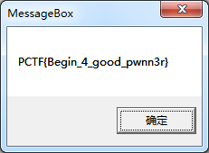
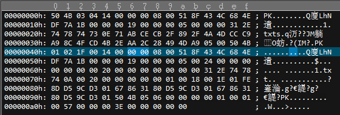
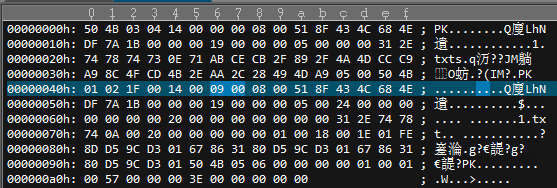
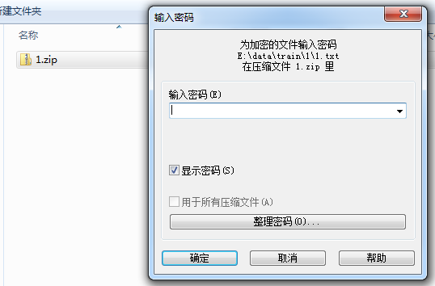
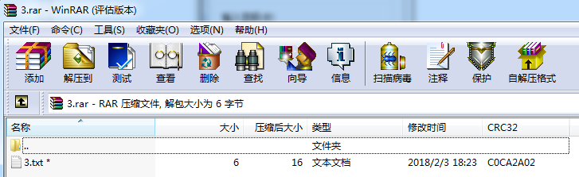

## 1.4 其他

> Misc还包含很多类型。本节继续给出一些题型。

### 取证

一般会给一个比较大的文件，可以是磁盘、抓包等，从中提取出信息。

题目：https://www.root-me.org/en/Challenges/Forensic/Find-the-cat

```
Simple steps using Kali:
1) gzip -d ch9.gz
2) photorec ch9 then
3) Select "Disk ch9 - 134 MB / 128MiB > " then hit ENTER
4) Select "FAT32" then hit ENTER
5) Select "[ Other ] FAT/..." then hit ENTER
6) Select "[ Whole ] Extract files from whole partition" then hit ENTER
7) On Directory selection just hit "c", it will extract in current folder
8) Then hit "q" until exit the program
9) Inside the new folder called "recup_dir.1" open the file "f0019458.odt" - it is a document file about 2.3 MB of size
10) You’ll see the cat inside. Right click the picture and select "Save" to any place and save it as "cat.jpg".
11) exiftool cat.jpg
12) There is two values that we are looking for: 
GPS Latitude: 47 deg 36’ 16.15" N
GPS Longitude: 7 deg 24’ 52.48" E
13) Google like coordinates in a different way: "47 36 16.15 N, 7 24 52.48 E". Search for it. You will find a france city with a german name.
```

### shellcode

题目: Jarvis OJ - Basic - shellcode

一段字符串不是密文，也不是编码，是一段shellcode

使用工具 https://github.com/inquisb/shellcodeexec 执行可得到结果。

或者使用如下程序运行：
```c
#include <stdio.h>
#include <stdlib.h>

int main()
{
    char code[] = "PYIIIIIIIIIIIIIIII7QZjAXP0A0AkAAQ2AB2BB0BBABXP8ABuJIYIhkmKzyCDq4l4FQyBlrRWEahI1tLKT16Pnk1ftLnkPvwlnkW6fhNkan5pNkgF6XPOR8T5HsCivaN19okQSPlKRLvD6DNk3uelNkpTthRXuQ9znk2jEHLK1Ja0FaXkhcTtBink4tlKUQhnvQYotqo0ylnLMTO0SDEWZahOtMwqhG8kXteksLwTdh1e8aLKsja4uQ8kavLKdLrklK0ZeL7qjKLKUTLKuQM8k9bdvDeL1qiSnR5XVIXTOyjENikrphNnrnVnhlBrzHooKOYoyok93u7tOKCNyHzBBSnguLgTcbyxlNKOYoYoMYaUTHphRL2LupQQ0htsFRTn541x3E2Se5T26PyKK8QLTddJlIZFBvyoSeUTLIkrv0oKy8ORpMmlk7Gl6DBrm8SoyoioyoaxrOqh0XwP1xu1Qw1upBbHrmrED3T34qiKOxQLTdEZOyZCaxQmRxgPUp0hpnPn4srRe8BDSo2PT7axqOCWROpophSYpnSo04u83K72Peu70hBpCsqDpF4qHIMXpLQ429k98aEaJr1BF3Ca3bIozp01IPf0Yof5GxAA";
    printf("len: %d\n", (int)sizeof(code)-1);
    int(*ret)() = (int(*)())code;
    ret();
}
```
执行后弹出窗口



### 压缩包伪加密

压缩源文件数据区： 
```
50 4B 03 04：这是头文件标记 
14 00：解压文件所需 pkware 版本 
00 00：全局方式位标记（有无加密） 
08 00：压缩方式 
07 76：最后修改文件时间 
F2 48：最后修改文件日期 
…… 
```
```
压缩源文件目录区： 
50 4B 01 02：目录中文件文件头标记(0x02014b50) 
1F 00：压缩使用的 pkware 版本 
14 00：解压文件所需 pkware 版本 
00 00：全局方式位标记（有无加密，这个更改这里进行伪加密，改为09 00打开就会提示有密码了） 
08 00：压缩方式 
07 76：最后修改文件时间 
F2 48：最后修改文件日期 
```
例如我们随便打个压缩包。更改压缩方式



`00 00`修改为`09 00`



再次尝试解压时，需要输入密码了



实际是没有加密的，把这个改回`00 00`就可以啦。

### 压缩包CRC爆破

文件被rar加密，发现文件大小只有6位，这时可以使用crc爆破



python程序
```python
import time
import rarfile
import binascii
import string
import itertools

rar = rarfile.RarFile('3.rar')
infos = rar.infolist()
starttime = time.time()
printable_list = string.ascii_lowercase
# printable_list = ['z', 'q', 'w', 'o', 'h', 'a', 'm', 'i']
crc_list = [item.CRC for item in infos]
print crc_list
r={}

for guess in itertools.permutations(printable_list, 6):
	crc32 = binascii.crc32("".join(guess))
	crc32 &= 0xffffffff
	if crc32 in crc_list:
		if not crc32 in r:
			r[crc32] = []
		r[crc32].append(guess)
							
def print_result(guesses, determined = ""):
	if len(guesses) < 1:
		print determined
		return
	for guess in guesses[0]:
		print_result(guesses[1:], determined + ''.join(guess))
		
print_result([r[crc32] for crc32 in crc_list])
endtime = time.time()
print endtime - starttime
```
解出内容
```
E:\data\train>crc_crack.py
[3234474498L]
whoami
136.804000139
```

### sql注入log

题目： RCTF-2015-Analysis nginx's log

给出了一个sqlmap跑的log，很明显是通过二分法暴力拖库的过程。

使用如下命令过滤出关键语句： `cat decode.txt | grep '!='`，得到最终的序列

`[82,79,73,83,123,109,105,83,99,95,65,110,64,108,121,83,105,115,95,110,71,49,110,120,95,76,48,103,125,5]`

转成ASCII得到`ROIS{miSc_An@lySis_nG1nx_L0g}`


