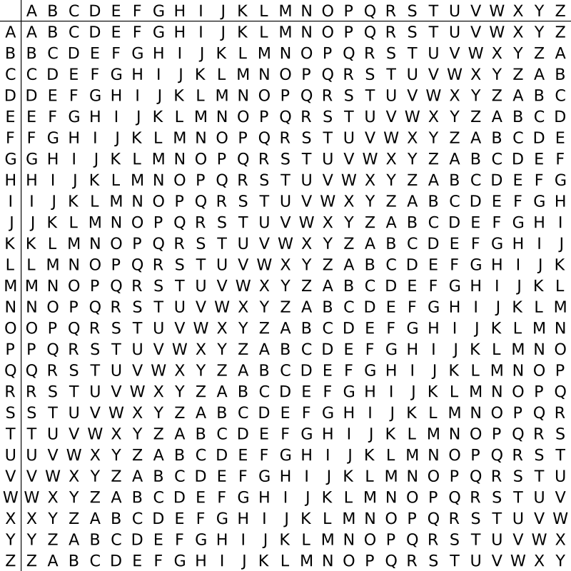
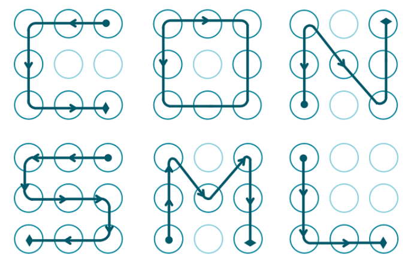
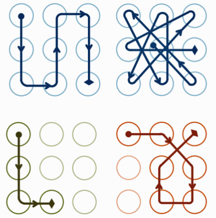

## 2.1 古典密码学

古典密码种类非常多，大多数以现在的观点来看都是非常不安全的。本节只涉及一些常见的，并给出一些例子。

### 凯撒密码

https://en.wikipedia.org/wiki/Caesar_cipher

凯撒密码（Caesar）加密时会将明文中的 每个字母 都按照其在字母表中的顺序向后（或向前）移动固定数目（循环移动）作为密文。

示例1 https://www.wechall.net/challenge/training/crypto/caesar/index.php

`BPM YCQKS JZWEV NWF RCUXA WDMZ BPM TIHG LWO WN KIMAIZ IVL GWCZ CVQYCM AWTCBQWV QA KKAQAPMOMLWA`

http://www.xarg.org/tools/caesar-cipher/

在线解出移动18位

`THE QUICK BROWN FOX JUMPS OVER THE LAZY DOG OF CAESAR AND YOUR UNIQUE SOLUTION IS CCSISHEGEDOS`

示例2 https://www.wechall.net/challenge/training/crypto/caesar2/index.php

ascii的范围扩展到了128以内的所有，凯撒密码进化版

```
52 7A 7A 6F 20 75 7A 6D 37 20 04 7A 00 20 7E 7A
77 01 70 6F 20 7A 79 70 20 78 7A 7D 70 20 6E 73
6C 77 77 70 79 72 70 20 74 79 20 04 7A 00 7D 20
75 7A 00 7D 79 70 04 39 20 5F 73 74 7E 20 7A 79
70 20 02 6C 7E 20 71 6C 74 7D 77 04 20 70 6C 7E
04 20 7F 7A 20 6E 7D 6C 6E 76 39 20 62 6C 7E 79
32 7F 20 74 7F 4A 20 3C 3D 43 20 76 70 04 7E 20
74 7E 20 6C 20 7C 00 74 7F 70 20 7E 78 6C 77 77
20 76 70 04 7E 7B 6C 6E 70 37 20 7E 7A 20 74 7F
20 7E 73 7A 00 77 6F 79 32 7F 20 73 6C 01 70 20
7F 6C 76 70 79 20 04 7A 00 20 7F 7A 7A 20 77 7A
79 72 20 7F 7A 20 6F 70 6E 7D 04 7B 7F 20 7F 73
74 7E 20 78 70 7E 7E 6C 72 70 39 20 62 70 77 77
20 6F 7A 79 70 37 20 04 7A 00 7D 20 7E 7A 77 00
7F 74 7A 79 20 74 7E 20 74 6D 6C 6F 6F 79 77 6D
74 79 7E 70 39 
```

使用python解出

```python
from __future__ import print_function
s = '52 7A 7A 6F 20 75 7A 6D 37 20 04 7A 00 20 7E 7A 77 01 70 6F 20 7A 79 70 20 78 7A 7D 70 20 6E 73 6C 77 77 70 79 72 70 20 74 79 20 04 7A 00 7D 20 75 7A 00 7D 79 70 04 39 20 5F 73 74 7E 20 7A 79 70 20 02 6C 7E 20 71 6C 74 7D 77 04 20 70 6C 7E 04 20 7F 7A 20 6E 7D 6C 6E 76 39 20 62 6C 7E 79 32 7F 20 74 7F 4A 20 3C 3D 43 20 76 70 04 7E 20 74 7E 20 6C 20 7C 00 74 7F 70 20 7E 78 6C 77 77 20 76 70 04 7E 7B 6C 6E 70 37 20 7E 7A 20 74 7F 20 7E 73 7A 00 77 6F 79 32 7F 20 73 6C 01 70 20 7F 6C 76 70 79 20 04 7A 00 20 7F 7A 7A 20 77 7A 79 72 20 7F 7A 20 6F 70 6E 7D 04 7B 7F 20 7F 73 74 7E 20 78 70 7E 7E 6C 72 70 39 20 62 70 77 77 20 6F 7A 79 70 37 20 04 7A 00 7D 20 7E 7A 77 00 7F 74 7A 79 20 74 7E 20 74 6D 6C 6F 6F 79 77 6D 74 79 7E 70 39 '
s = s.split()

for key in range(0,128+1,1):
    for i in s:
        i = int(i,16)
        print (chr((i + key) % 128 ), end = '')
    print (key)
```

### 简单替换密码

https://en.wikipedia.org/wiki/Substitution_cipher#Simple_substitution

将每个明文字母替换为与之唯一对应且不同的字母。它与恺撒密码之间的区别是其密码字母表的字母不是简单的移位，而是完全是混乱的，这也使得其破解难度要高于凯撒密码。

比如：

```
明文字母 : abcdefghijklmnopqrstuvwxyz
秘钥字母 : phqgiumeaylnofdxjkrcvstzwb
```

a 对应 p，d 对应 h，以此类推。

明文： `the quick brown fox jumps over the lazy dog`

密文： `cei jvaql hkdtf udz yvoxr dsik cei npbw gdm`

而解密时，我们一般是知道了每一个字母的对应规则，才可以正常解密。

示例1 https://www.wechall.net/challenge/training/crypto/simplesub1/index.php

`FS JAK NIWXBAJS BMR SMH QND PKNR JAXV WS YPXKDR X NW XWOPKVVKR ZKPS LKII RMDK SMHP VMIHJXMD CKS XV PQXOIWIANVMM JAXV IXJJIK QANIIKDBK LNV DMJ JMM ANPR LNV XJ`

解题思路是频率分析，一般英文字母中出现概率最高的是e，那么以上出现频率最高的密文就很可能对应明文e

在线破解 https://quipqiup.com/

`0	-1.457	BY THE ALMIGHTY GOD YOU CAN READ THIS MY FRIEND I AM IMPRESSED VERY WELL DONE YOUR SOLUTION ?EY IS RCIPLMLHASOO THIS LITTLE CHALLENGE WAS NOT TOO HARD WAS IT`

示例2 https://www.wechall.net/challenge/training/crypto/digraph/index.php

`ynvnyortlasclxipwlsclxqevnyoeajt cqvnip nusfkzlabifnlxsfnu lxvfqeea uzsfeaeascrtsf eaipkzkzsfeaeanqipwlwlbijt mfscea yovnlx lxvnvn nuqenqnqqekzipwllx sfqelxvfsflaiz pjscea qelxsw mfsfwlwliz rtvnvnnu klvnidjt kwyolxsfla lxvfqeea bfsfbipjvnlanu scea eavnwliplxqevnyoth fnyovnuzlaqenuyolakzvfvfjt`

这个增加了一点变化，每个字母对应2个密文了，重新整理下密文弄成单个字母，然后quipqiup在线解出。

```python
s = "ynvnyortlasclxipwlsclxqevnyoeajt cqvnip nusfkzlabifnlxsfnu lxvfqeea uzsfeaeascrtsf eaipkzkzsfeaeanqipwlwlbijt mfscea yovnlx lxvnvn nuqenqnqqekzipwllx sfqelxvfsflaiz pjscea qelxsw mfsfwlwliz rtvnvnnu klvnidjt kwyolxsfla lxvfqeea bfsfbipjvnlanu scea eavnwliplxqevnyoth fnyovnuzlaqenuyolakzvfvfjt"
s_arr = s.split()
arr = []
for c in s_arr:
	for i in range(len(c)):
		if i % 2 == 0:
			print c[i:i+2]
			if c[i:i+2] not in arr:
				arr.append(c[i:i+2])
print arr

# jt sw th yn
# ['yn', 'vn', 'yo', 'rt', 'la', 'sc', 'lx', 'ip', 'wl', 'qe', 'ea', 'jt', 'cq', '
# nu', 'sf', 'kz', 'bi', 'fn', 'vf', 'uz', 'nq', 'mf', 'iz', 'pj', 'sw', 'kl', 'id
# ', 'kw', 'bf', 'th']

# [, 'vn', 'yo', 'rt', 'la', 'sc', 'lx', 'ip', 'wl', 'qe', 'ea', 'cq', '
# nu', 'sf', 'kz', 'bi', 'fn', 'vf', 'uz', 'nq', 'mf', 'iz', 'pj', 'kl', 'id
# ', 'kw', 'bf']
ret = ""
for c in s_arr:
	ret = ret + " "
	for i in range(len(c)):
		if i % 2 == 0:
			t = c[i:i+2]
			if t == "vn":
				ret = ret + "a"
			elif t == "yo":
				ret = ret + "b"
			elif t == "rt":
				ret = ret + "c"
			elif t == "la":
				ret = ret + "d"
			elif t == "sc":
				ret = ret + "e"
			elif t == "lx":
				ret = ret + "f"
			elif t == "ip":
				ret = ret + "g"
			elif t == "wl":
				ret = ret + "h"
			elif t == "qe":
				ret = ret + "i"
			elif t == "ea":
				ret = ret + "j"
			elif t == "cq":
				ret = ret + "k"
			elif t == "nu":
				ret = ret + "l"
			elif t == "sf":
				ret = ret + "m"
			elif t == "kz":
				ret = ret + "n"
			elif t == "bi":
				ret = ret + "o"
			elif t == "fn":
				ret = ret + "p"
			elif t == "vf":
				ret = ret + "q"
			elif t == "uz":
				ret = ret + "r"
			elif t == "nq":
				ret = ret + "s"
			elif t == "mf":
				ret = ret + "t"
			elif t == "iz":
				ret = ret + "u"
			elif t == "pj":
				ret = ret + "v"
			elif t == "kl":
				ret = ret + "w"
			elif t == "id":
				ret = ret + "x"
			elif t == "kw":
				ret = ret + "y"
			elif t == "bf":
				ret = ret + "z"
			else:
				ret = ret + "?"
print ret
# ?abcdefghefiabj? kag lmndopfml fqij rmjjecm jgnnmjjsghho? tej baf faa lissinghf
# mifqmdu vej if? tmhhu caal wax? ybfmd fqij zmovadl ej jahgfiab? pbardilbdnqq?
# http://quipqiup.com/
# ?ongratulations? ?ou decrypted this message successfully? ?as not too difficult either? was it? ?ell? good box? ?nter this keyword as solution? pnomridnrchh?
```

### Playfair

https://zh.wikipedia.org/wiki/%E6%B3%A2%E9%9B%B7%E8%B2%BB%E5%AF%86%E7%A2%BC

- 选取一个英文字作密钥。除去重复出现的字母。将密钥的字母逐个逐个加入5×5的矩阵内，剩下的空间将未加入的英文字母依a-z的顺序加入。（将Q去除，或将I和J视作同一字。）
- 将要加密的讯息分成两个一组。若组内的字母相同，将X（或Q）加到该组的第一个字母后，重新分组。若剩下一个字，也加入X字。
- 在每组中，找出两个字母在矩阵中的地方。
  - 若两个字母不在同一直行或同一横列，在矩阵中找出另外两个字母，使这四个字母成为一个长方形的四个角。
  - 若两个字母在同一横列，取这两个字母右方的字母（若字母在最右方则取最左方的字母）。
  - 若两个字母在同一直行，取这两个字母下方的字母（若字母在最下方则取最上方的字母）。

新找到的两个字母就是原本的两个字母加密的结果。

取“playfair example”为密钥，得
```
P L A Y F
I R E X M
B C D G H
K N O Q S
T U V W Z
```
要加密的讯息为“Hide the gold in the tree stump”：
`HI DE TH EG OL DI NT HE TR EX ES TU MP`
就会得到`“MB OD ZB XD NA BE KU DM UI XM MO UV IF”`。

示例：
```
Ciphertext: RSXIXTRVFXSX
Key：THEQUICKBROWNFOXJUMPSOVERALAZYDOG
Plaintext:？
```

在线破解 http://rumkin.com/tools/cipher/playfair.php

得到明文 `KAOROUBANFAN`

### 维吉尼亚密码

https://zh.wikipedia.org/wiki/%E7%BB%B4%E5%90%89%E5%B0%BC%E4%BA%9A%E5%AF%86%E7%A0%81

在一个凯撒密码中，字母表中的每一字母都会作一定的偏移，例如偏移量为3时，A就转换为了D、B转换为了E……而维吉尼亚密码则是由一些偏移量不同的恺撒密码组成。

为了生成密码，需要使用表格法。这一表格包括了26行字母表，每一行都由前一行向左偏移一位得到。具体使用哪一行字母表进行编译是基于密钥进行的，在过程中会不断地变换。



例如，假设明文为：

`ATTACKATDAWN`

选择某一关键词并重复而得到密钥，如关键词为LEMON时，密钥为：

`LEMONLEMONLE`

对于明文的第一个字母A，对应密钥的第一个字母L，于是使用表格中L行字母表进行加密，得到密文第一个字母L。类似地，明文第二个字母为T，在表格中使用对应的E行进行加密，得到密文第二个字母X。以此类推，可以得到：
```
明文：ATTACKATDAWN
密钥：LEMONLEMONLE
密文：LXFOPVEFRNHR
```

示例： 
https://www.root-me.org/en/Challenges/Cryptanalysis/Polyalphabetic-substitution-Vigenere

在线破解，步骤如下：
- Open https://f00l.de/hacking/vigenere.php website
- Copy and paste the cipher text
- Click analyze, click crack you will get key length anda password -. key length : 9, key: thementor
- You will get the story about the hacker manifesto
- Use Google to search the author and you will get : Loyd Blankenship


### 培根密码

https://zh.wikipedia.org/wiki/%E5%9F%B9%E6%A0%B9%E5%AF%86%E7%A2%BC

加密时，明文中的每个字母都会转换成一组五个英文字母。其转换依靠下表：
```
a   AAAAA   g     AABBA   n    ABBAA   t     BAABA
b   AAAAB   h     AABBB   o    ABBAB   u-v   BAABB
c   AAABA   i-j   ABAAA   p    ABBBA   w     BABAA
d   AAABB   k     ABAAB   q    ABBBB   x     BABAB
e   AABAA   l     ABABA   r    BAAAA   y     BABBA
f   AABAB   m     ABABB   s    BAAAB   z     BABBB
```
这只是一款最常用的加密表，有另外一款将每种字母配以不同的字母组予以转换，即I与J、U与V皆有不同编号。

加密者需使用两种不同字体，分别代表A和B。准备好一篇包含相同AB字数的假信息后，按照密文格式化假信息，即依密文中每个字母是A还是B分别套用两种字体。

解密时，将上述方法倒转。所有字体一转回A，字体二转回B，以后再按上表拼回字母。

法兰西斯·培根另外准备了一种方法，其将大小写分别看作A与B[3]，可用于无法使用不同字体的场合（例如只能处理纯文本时）。但这样比起字体不同更容易被看出来，而且和语言对大小写的要求也不太兼容。

培根密码本质上是将二进制信息通过样式的区别，加在了正常书写之上。培根密码所包含的信息可以和用于承载其的文章完全无关。

以下一段包含了'steganography'，正常字体是A，粗体是B：

**T**o en**co**de **a** mes**s**age e**ac**h letter **of** the **pl**aint**ex**t **i**s replaced b**y** **a** **g**rou**p** **of** **f**i**ve** of **th**e lett**ers** '**A**' o**r** '**B**'.

示例： https://www.wechall.net/challenge/training/encodings/bacon/index.php

```
BaCoN's cIphEr or THE bacOnIAN CiPHer iS a meThOD oF sTEGaNOGrapHY (a METhoD Of HidIng A sECRet MeSsaGe as OpPOsEd TO a TRUe CiPHeR) dEVIseD BY francis bAcoN. a MessAge Is coNCeALED in THe pRESenTatIoN OF TexT, ratHer thaN iTs coNteNt. tO enCODe A MEsSaGe, eaCh lETter Of THe pLAInText Is rePLAcED By A groUp oF fIvE OF The lEttERS 'a' oR 'B'. ThIs REpLacemENT is doNe acCORdINg To thE ALphAbeT of tHe BACOnIAN cIpHeR, sHoWn bElOw. NoTe: A SeCoNd vErSiOn oF BaCoN'S CiPhEr uSeS A UnIqUe cOdE FoR EaCh lEtTeR. iN OtHeR WoRdS, i aNd j eAcH HaS ItS OwN PaTtErN. tHe wRiTeR MuSt mAkE UsE Of tWo dIfFeReNt tYpEfAcEs fOr tHiS CiPhEr. AfTeR PrEpArInG A FaLsE MeSsAgE WiTh tHe sAmE NuMbEr oF LeTtErS As aLl oF ThE As aNd bS In tHe rEaL, sEcReT MeSsAgE, tWo tYpEfAcEs aRe cHoSeN, oNe tO RePrEsEnT As aNd tHe oThEr bS. tHeN EaCh lEtTeR Of tHe fAlSe mEsSaGe mUsT Be pReSeNtEd iN ThE ApPrOpRiAtE TyPeFaCe, AcCoRdInG To wHeThEr iT StAnDs fOr aN A Or a b. To dEcOdE ThE MeSsAgE, tHe rEvErSe mEtHoD Is aPpLiEd. EaCh 'TyPeFaCe 1' LeTtEr iN ThE FaLsE MeSsAgE Is rEpLaCeD WiTh aN A AnD EaCh 'TyPeFaCe 2' LeTtEr iS RePlAcEd wItH A B. tHe bAcOnIaN AlPhAbEt iS ThEn uSeD To rEcOvEr tHe oRiGiNaL MeSsAgE. aNy mEtHoD Of wRiTiNg tHe mEsSaGe tHaT AlLoWs tWo dIsTiNcT RePrEsEnTaTiOnS FoR EaCh cHaRaCtEr cAn bE UsEd fOr tHe bAcOn cIpHeR. bAcOn hImSeLf pRePaReD A BiLiTeRaL AlPhAbEt[2] FoR HaNdWrItTeN CaPiTaL AnD SmAlL LeTtErS WiTh eAcH HaViNg tWo aLtErNaTiVe fOrMs, OnE To bE UsEd aS A AnD ThE OtHeR As b. ThIs wAs pUbLiShEd aS An iLlUsTrAtEd pLaTe iN HiS De aUgMeNtIs sCiEnTiArUm (ThE AdVaNcEmEnT Of lEaRnInG). BeCaUsE AnY MeSsAgE Of tHe rIgHt lEnGtH CaN Be uSeD To cArRy tHe eNcOdInG, tHe sEcReT MeSsAgE Is eFfEcTiVeLy hIdDeN In pLaIn sIgHt. ThE FaLsE MeSsAgE CaN Be oN AnY ToPiC AnD ThUs cAn dIsTrAcT A PeRsOn sEeKiNg tO FiNd tHe rEaL MeSsAgE.
```

解题思路：大写取值B，小写取值A，5个一组按照对应的表解出明文字母

python程序如下：
```python
dict = {"AAAAA":"a","AAAAB":"b","AAABA":"c","AAABB":"d","AABAA":"e","AABAB":"f","AABBA":"g","AABBB":"h","ABAAA":"i","ABAAB":"j","ABABA":"k","ABABB":"l","ABBAA":"m","ABBAB":"n","ABBBA":"o","ABBBB":"p","BAAAA":"q","BAAAB":"r","BAABA":"s","BAABB":"t","BABAA":"u","BABAB":"v","BABBA":"w","BABBB":"x","BBAAA":"y","BBAAB":"z"}

def baconDecrypt(s):
	p = []
	flag = []
	for i in range(len(s)):
		if s[i].isupper():
			flag.append('B')
		elif s[i].islower():
			flag.append('A')
	return ''.join(flag)
	
s = "'BaCoN's cIphEr or THE bacOnIAN CiPHer iS a meThOD oF sTEGaNOGrapHY (a METhoD Of HidIng A sECRet MeSsaGe as OpPOsEd TO a TRUe CiPHeR) dEVIseD BY francis bAcoN. a MessAge Is coNCeALED in THe pRESenTatIoN OF TexT, ratHer thaN iTs coNteNt. tO enCODe A MEsSaGe, eaCh lETter Of THe pLAInText Is rePLAcED By A groUp oF fIvE OF The lEttERS 'a' oR 'B'. ThIs REpLacemENT is doNe acCORdINg To thE ALphAbeT of tHe BACOnIAN cIpHeR, sHoWn bElOw. NoTe: A SeCoNd vErSiOn oF BaCoN'S CiPhEr uSeS A UnIqUe cOdE FoR EaCh lEtTeR. iN OtHeR WoRdS, i aNd j eAcH HaS ItS OwN PaTtErN. tHe wRiTeR MuSt mAkE UsE Of tWo dIfFeReNt tYpEfAcEs fOr tHiS CiPhEr. AfTeR PrEpArInG A FaLsE MeSsAgE WiTh tHe sAmE NuMbEr oF LeTtErS As aLl oF ThE As aNd bS In tHe rEaL, sEcReT MeSsAgE, tWo tYpEfAcEs aRe cHoSeN, oNe tO RePrEsEnT As aNd tHe oThEr bS. tHeN EaCh lEtTeR Of tHe fAlSe mEsSaGe mUsT Be pReSeNtEd iN ThE ApPrOpRiAtE TyPeFaCe, AcCoRdInG To wHeThEr iT StAnDs fOr aN A Or a b. To dEcOdE ThE MeSsAgE, tHe rEvErSe mEtHoD Is aPpLiEd. EaCh 'TyPeFaCe 1' LeTtEr iN ThE FaLsE MeSsAgE Is rEpLaCeD WiTh aN A AnD EaCh 'TyPeFaCe 2' LeTtEr iS RePlAcEd wItH A B. tHe bAcOnIaN AlPhAbEt iS ThEn uSeD To rEcOvEr tHe oRiGiNaL MeSsAgE. aNy mEtHoD Of wRiTiNg tHe mEsSaGe tHaT AlLoWs tWo dIsTiNcT RePrEsEnTaTiOnS FoR EaCh cHaRaCtEr cAn bE UsEd fOr tHe bAcOn cIpHeR. bAcOn hImSeLf pRePaReD A BiLiTeRaL AlPhAbEt[2] FoR HaNdWrItTeN CaPiTaL AnD SmAlL LeTtErS WiTh eAcH HaViNg tWo aLtErNaTiVe fOrMs, OnE To bE UsEd aS A AnD ThE OtHeR As b. ThIs wAs pUbLiShEd aS An iLlUsTrAtEd pLaTe iN HiS De aUgMeNtIs sCiEnTiArUm (ThE AdVaNcEmEnT Of lEaRnInG). BeCaUsE AnY MeSsAgE Of tHe rIgHt lEnGtH CaN Be uSeD To cArRy tHe eNcOdInG, tHe sEcReT MeSsAgE Is eFfEcTiVeLy hIdDeN In pLaIn sIgHt. ThE FaLsE MeSsAgE CaN Be oN AnY ToPiC AnD ThUs cAn dIsTrAcT A PeRsOn sEeKiNg tO FiNd tHe rEaL MeSsAgE.'"
c = baconDecrypt(s)
print c

ret = ""
for i in range(len(c)):
	if i % 5 == 0:
		t = c[i:i+5]
		if dict.has_key(t):
			ret = ret + dict[t]
		else:
			ret = ret + "?"
print ret

# veryxwellxdonexfellowxhackerxthexsecretxkeywordxisxrhhliochndsixxkvfk?su??jouw?k
# wwurnw?vfnfwjksvewvlkxlk?jnjvmtmtevlkuvjfknkzeuvuvskkszktnkwvkvsu?soevwvjkkzkvkv
# jwwvsvu?vkvjvjosvvjuwkskwvjlfjfjnjflkvlnfkjuskkvfjk?k?vnkwvwwvuwusvjkzu?wwkjktfk
# stmvjkvnkwkwvwvskk?fsskvfnlfkswkkwwvwnvwskxkktjfv?

# rhhliochndsi
```

### 栅栏密码

https://zh.wikipedia.org/wiki/%E7%B1%AC%E7%AC%86%E5%AF%86%E7%A2%BC%E6%B3%95

明文由上至下顺序写上，当到达最低部时，再回头向上，一直重复直至整篇明文写完为止。然后，再往右顺序抄写一次。

此例子中，其包含了三条篱笆及一段明文：'WE ARE DISCOVERED. FLEE AT ONCE'。然后再按法抄下：
```
W . . . E . . . C . . . R . . . L . . . T . . . E
. E . R . D . S . O . E . E . F . E . A . O . C .
. . A . . . I . . . V . . . D . . . E . . . N . .
```
读取后再按传统分组：

`WECRL TEERD SOEEF EAOCA IVDEN`

示例： https://www.root-me.org/en/Challenges/Cryptanalysis/Transposition-Rail-Fence

Here is the python code to brute-force number of rails for the given encrypted text . 

```python
def fence(width, numrails):
    fence = [[None] * len(width) for n in range(numrails)]
    rails = range(numrails - 1) + range(numrails - 1, 0, -1)
    for n, x in enumerate(width):
        fence[rails[n % len(rails)]][n] = x
 
    if 0: # debug                                                                                                                  # greater then 3 fence to create width  
        for rail in fence:                                                                                                        # taken from stack overflow/George
            print (''.join('.' if c is None else str(c) for c in rail))
 
    return [c for rail in fence for c in rail if c is not None]
 
def decode(text, n):
    rng = range(len(text))
    pos = fence(rng, n)
    return ''.join(text[pos.index(n)] for n in rng)
 
z = "Wnb.r.ietoeh Fo'lKutrts'znl cc hi ee ekOtggsnkidy hini cna neea civo lh"
 
for i in range(3,15):
    y = decode(z, i)
    print y 
```
```
Wuitnr tbsc'.znnrla .c ci nheie teeeo aeek Ohtcg gisFnvkoiod'y  lhliKnh
W en Fnoeek'blOetK.ugagtrrs nt.skci'izdiynel vh tcionco i  heicln heah 
Wolnak enhci dc bF yc ho.'ihii lrKenvieu.t  oceritkn aOse't lngztngehes
Wts hcie'onezkniiOnhb lt vcg F.ocgnoasc'rl n  nkhK.uiieled tireyah  ete
WiKcgii g uentthscvnnirobet kao iesh. 'edn ey zFrone elahkl'.l Oi hcntc
Will invade Kentucky on October the eighth. signal is 'Frozen chicken'.
W.o'ighnoeig z'inelnesne ainelKtbou  k  lcciecte.hrckdnihvayO t rFsht  
Wrht esinoenn cr .niFtcekie a ik soebt''hOdc lcnytizlo.eKn g aihv hgelu
WrhuniOiieoe dt lt .niFr egyca  n gectoebt'sc shacli ine 'lo.eKzhkknnvh
Wrhuniknhna  aikO lt .niFr etin clinidgectoebt'sc gy evhoec se 'lo.eKzh
W.torliknhna  aikO  t'orn.elscetin clinidgec'Khibe uz  gy evhoec sehntF
W.tFu'c knhna  aikOecztoorn.e'rn etin clinidg hltlhibe Ks iegy evhoec s
W.tFu'c ksyi   cn  nOecztoorn.e'rn etkhceilveniig hltlhibe Ks iegdnaaoh
W.tFu'c ksyiaeilva   nOecztoorn.e'rn etkhcn oh ceniig hltlhibe Ks iegdn
W.tFu'c egk iaeilva  higkecztoorn.e'rn eOsdicn oh cennynt hltlhibe Ks i
```
Only the rail = 8 make sense :
**Will invade Kentucky on October the eighth. signal is ’Frozen chicken’.**

FLAG=Frozen chicken


### 转置密码

https://en.wikipedia.org/wiki/Transposition_cipher

在密码学中，转置密码是一种加密方法，通过这种方法，明文单元（通常是字符或字符组）所保持的位置按照常规系统进行移位，使得密文构成明文的置换。 也就是说，单位的顺序被改变（明文被重新排序）。

上面的栅栏密码实际上也属于转置密码的一种方式。

示例 https://www.wechall.net/challenge/training/crypto/transposition1/index.php

`oWdnreuf.lY uoc nar ae dht eemssga eaw yebttrew eh nht eelttre sra enic roertco drre . Ihtni koy uowlu dilekt  oes eoyrup sawsro don:wh carpgsllma.m`

oWdnreuf.l先取第二个，再取第一个。再取第四个，再取第三个。。。得到Wonderful.

python程序如下：
```python
from __future__ import print_function
s = "oWdnreuf.lY uoc nar ae dht eemssga eaw yebttrew eh nht eelttre sra enic roertco drre . Ihtni koy uowlu dilekt  oes eoyrup sawsro don:wh carpgsllma.m"
result = ""
for i in range(0, len(s), 2):
	print (s[i+1] + s[i],end='')
# Wonderful. You can read the message way better when the letters are in correct order. I think you would like to see your password now: hacprsgllamm.
```

### 键盘密码

手机键盘密码

手机键盘加密方式，是每个数字键上有 3-4 个字母，用两位数字来表示字母，例如：ru 用手机键盘表示就是：7382，那么这里就可以知道了，手机键盘加密方式不可能用 1 开头，第二位数字不可能超过 4。

电脑键盘密码

- 电脑键盘坐标加密，利用键盘上面的字母行和数字行来加密，例：bye 用电脑键盘 XY 表示就是：351613

- 电脑键盘QWE加密法，就是用字母表替换键盘上面的排列顺序。 QWE=ABC， 即把键盘上的字母按顺序对应ABC

- 电脑键盘轨迹？ 例如： `BHUK,LP TGBNHGYT BHUK,LP UYGBN TGBNHGYT BHUK,LP BHUK,LP TGBNHGYT BHUK,LP TGBNHGYT UYGBN` 在键盘上按顺序出来得到: `NBNCBNNBNBC`

### Android lock pattern

安卓手势密码

除了很多用户会倾向于选择最弱等级的密码外，还有不少用户喜欢用字母的样式来作为自己的手势密码。比如下面这张图中所揭示的案例，C、O、N、S、M、L 这些字母样式都成了用户的手势密码。这其实就相当于字符密码界的 12345678、password……



从安全的角度考虑，调研者会倾向于让用户设置更加复杂多变的手势密码，比如像下图这样：



其实这样的设置会带来很大使用上的不便。 

手势密码看起来不安全。

手势密码只包含1-8。例如字母L，对应03678
```
    For guide here is the pattern (starting at 0 in the top left corner):
 
                    |0|1|2|   
                    |3|4|5|
                    |6|7|8|
```

示例：https://www.root-me.org/en/Challenges/Cryptanalysis/System-Android-lock-pattern

Download and decompress the given ch17.tbz2
That will create a ’android’ directory.
From the Linux terminal, we are searching for the gesture.key which is the file in which Android is storing the secret, and we display it as hex values.

```bash
# cat `find android/ -name gesture.key` | xxd -ps
2c3422d33fb9dd9cde87657408e48f4e635713cb
```

So, now you only have to put this string in the script below as the value of hashtofind variable and run the script:

```python
#!/usr/bin/python
 
import hashlib
import itertools
 
#given hash from ./android/data/system/gesture.key
#2c 34 22 d3 3f b9 dd 9c de 87 65 74 08 e4 8f 4e 63 57 13 cb
 
charset = "012345678"
hashtofind = "2c3422d33fb9dd9cde87657408e48f4e635713cb"
for passlen in range(1,10):
  print "pass len tested is %d" %passlen
  for k in itertools.permutations(charset, passlen):
    strpass = "".join([chr(ord(item)-48) for item in k])
    h = hashlib.new('sha1')
    h.update(strpass)
    if h.hexdigest().upper().find(hashtofind.upper()) == 0:
      print "found for %s" % ''.join(k) 
      exit(-1)
```

