## 3.1 逆向工程基础

逆向工程重在实践。本节通过实例介绍逆向的思路和方法。

### RCTF-2015-TankGame

题目特点： 这一章的第一题以坦克大战游戏开始提高兴趣。我们不以常规思路解此题，不用逆向相关工具和方法。

运行游戏发现，选双打，绿色坦克可以用wsad上下左右控制，空格是子弹。敌人太强，根本玩不过。。

游戏map文件夹是地图。通过熟悉地图文件的格式。我们可以修改地图。

地图文件改成这样


然后游戏成了这样

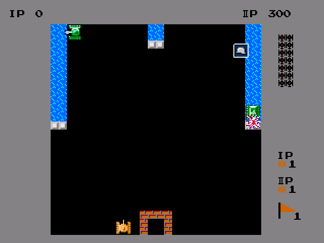

然后就一直打下去直到flag出现。。

### XMAN 入门篇-课堂练习-cm1

本题目是最简单的逆向

使用IDA Pro打开文件后，按F5反编译，比较输入字符串和str2相等。

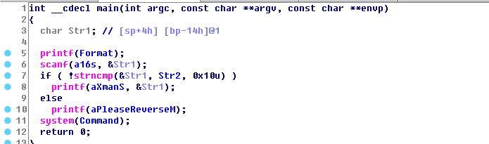

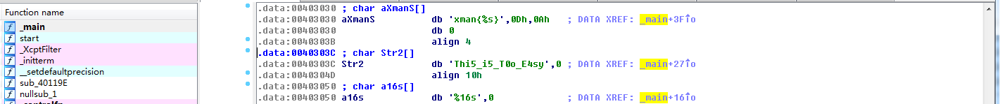

`str2: Thi5_i5_T0o_E4sy`

`flag: xman{Thi5_i5_T0o_E4sy}`

### XMAN 入门篇-课堂练习-cm2

本题目在上道题的基础上，增加了简单的计算。输入的字符串v5与0到14异或，得到的v12如果等于aX1p5vyi8Uc8J的值，则OK.

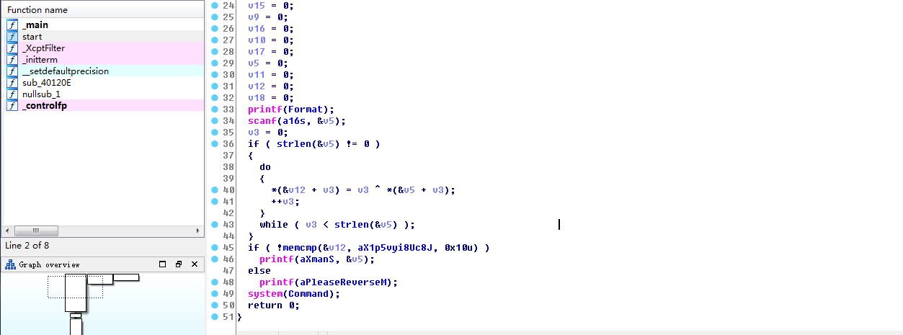

那么v5等于aX1p5vyi8Uc8J的值与0到14异或

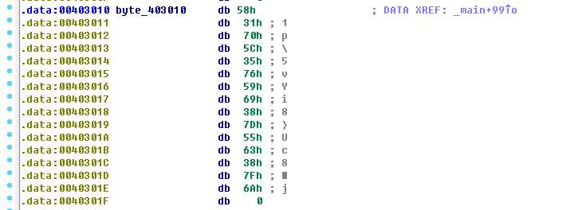

python解出flag
```python
s = "5831705C35765969387D5563387F6A"
out = ""
count = 0
for i in range(0, len(s), 2):
	out += chr(int(s[i:i+2], 16) ^ count)
	count += 1
print out
```
`input：X0r_1s_n0t_h4rd`

`flag: xman{X0r_1s_n0t_h4rd}`

### XMAN 入门篇-课堂练习-cm3

本题目和上一道类似。这里的关键不再是私有算法，而是标准的base64，需要从代码中识别出来是base64的算法逻辑。

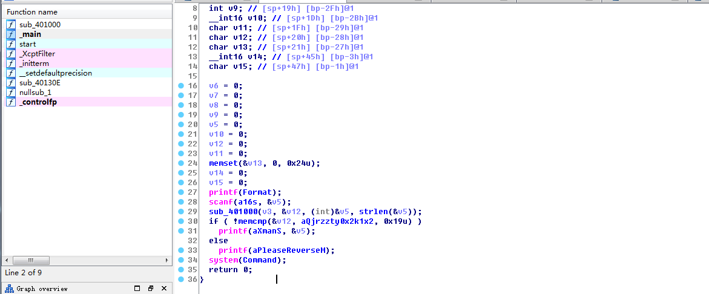


sub_401000是base64编码

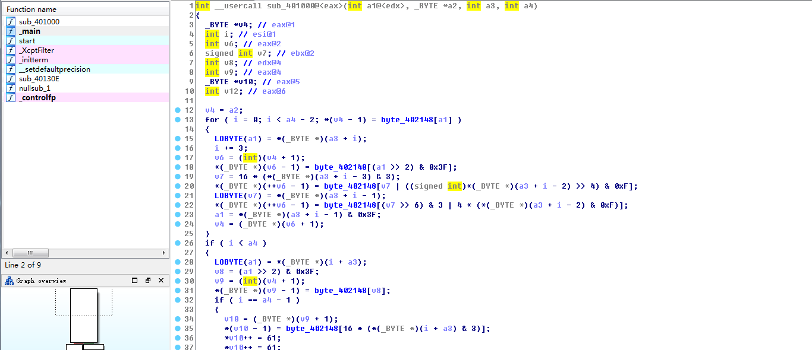

直接base64解码即可:

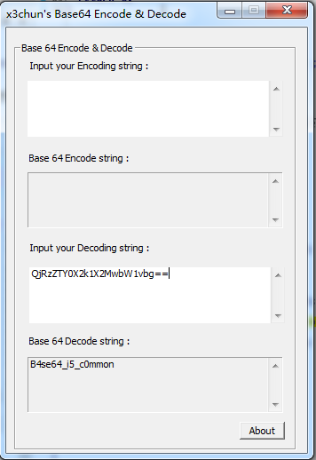

`B4se64_i5_c0mmon`

### XMAN 入门篇-课堂练习-cm4

本题目可以根据初始化向量值识别出来是md5

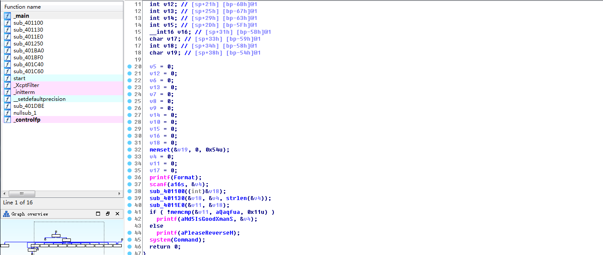

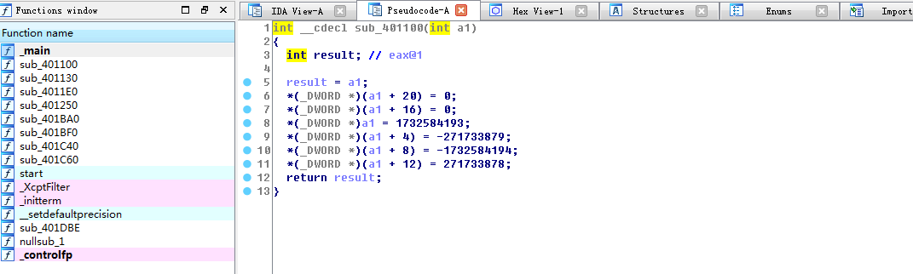

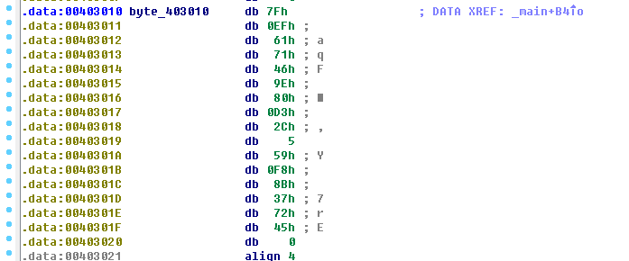

解密7FEF6171469E80D32C0559F88B377245

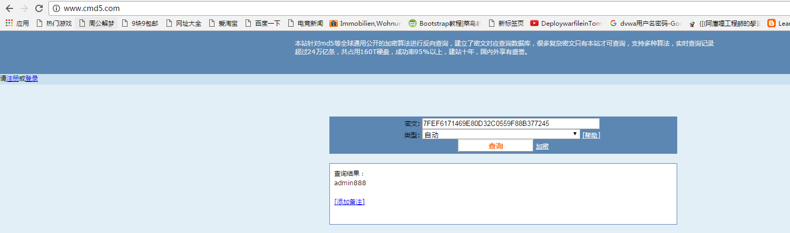

`admin888`

### XMAN 入门篇-课堂练习-cm8

本题目有一定技巧。我们可以不管输入。通过暴力破解得到输出的flag


64004747430446506B05476B4004040404040404040404040404040404040404040404040404040404040404040404040404040404040404046B5804045315

不用管if条件。打印的flag在进入if条件后出现。
循环63次，每次都异或v3，可以暴力破解256次，得出可见字符。

python解出：
```python
import binascii
import string
enflag = "64004747430446506B05476B4004040404040404040404040404040404040404040404040404040404040404040404040404040404040404046B5804045315"
result = binascii.a2b_hex(enflag)
print len(result)

for i in range(256):
	s = ""
	for j in result:
		j = ord(j) ^ i
		s = s + chr(j)
	print s
	if string.find(s,"P4ssw0rd_1s") != -1:
		print "i================" + str(i)
		
print "========================"

i = 0x34
s = ""
for j in result:
	j = ord(j) ^ i
	s = s + chr(j)
print s 
```

`xman{P4ssw0rd_1s_t00000000000000000000000000000000000000000000_l00g!}`

### XMAN 入门篇-课堂练习-cm6

本题目需要耐心分析清楚逻辑。实际是一个迷宫。超过边界或遇到*则失败，最后为#就成功了。


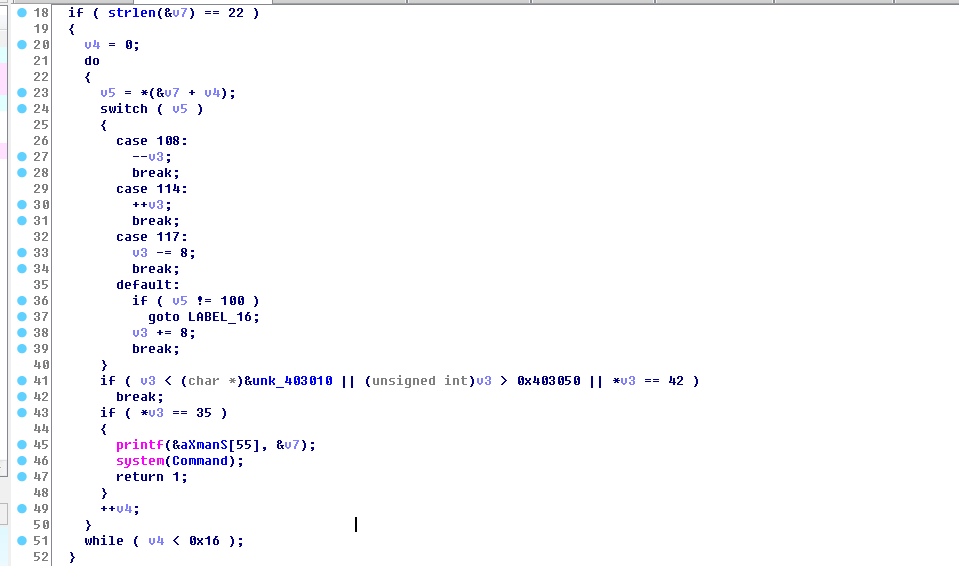

d, r, u, l可以操作移动。
```python
>>> chr(42)
'*'
>>> chr(35)
'#'
>>> chr(108)
'l'
>>> chr(114)
'r'
>>> chr(117)
'u'
>>> chr(100)
'd'
>>>
```
22次移动到#，轨迹为dddddrrrrruuuuullldddr

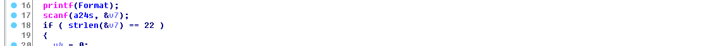

`xman{dddddrrrrruuuuullldddr}`

### XMAN 入门篇-课堂练习-cm9

本题目逆向发现是RC4加密，密钥通过伪随机函数srand生成256个字节。同一种子数产生的序列会相同。从某一个时刻开始，对时间t进行暴力破解得到可见字符时，产生flag。

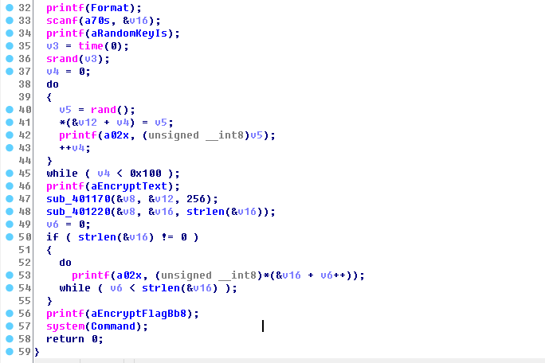

使用c编程破解：
```cpp

#include "stdafx.h"
#include <windows.h>
#include <time.h>
#include <stdlib.h>
#include <openssl/rc4.h>
#include <stdio.h>
#include <STDLIB.H>
#pragma comment (lib, "ws2_32.lib")
#pragma comment (lib, "LIBEAY32.lib")

void GenSessionKey (time_t t, OUT BYTE* pcbSessionKey)
{
	srand(t);
	for (int i = 0; i < 256; i++)
	{
		pcbSessionKey[i] = (BYTE)rand();
	}
}

BYTE p0[] = "\xBB\x85\x1C\x12\x34\x22\xD0\xFC\x66\x0D\xA8\x91\x99\x2A\xFE\x23\x61\x22\x7D\x81\x07\x54\xA6\xA7";

void CalcCorrectSessionKey(OUT BYTE* correctKey) 
{
	tm tt = {0};
	tt.tm_year = 2014-1900;
	tt.tm_yday = 189;
	tt.tm_wday = 3;
	tt.tm_hour = 1;
	tt.tm_mday = 9;
	tt.tm_min = 33;
	tt.tm_mon = 6;
	tt.tm_sec = 36;
	time_t t = mktime(&tt);

	BYTE cbText[0x40];
	BYTE k[256];

	int len = sizeof(p0) - 1;
	for (int j = 1; j > 0; j++)
	{
		memset(cbText, 0 , 0x40);
		GenSessionKey(t, k);
		RC4_KEY key;
		RC4_set_key(&key, 256, k);
		RC4(&key, len, p0, (BYTE*)cbText);
		int i;
		for (i = 0; i < len; i++)
		{
			if (cbText[i] >= 0x80)
			{
				break;
			}
		}
		if (i >=len)
		{
			memcpy(correctKey, k ,256);
			break;
		}
		t++;
	}
}

void Decrypt(const BYTE* k, const BYTE* msg, int len)
{
	BYTE cbText[0x40] = {0};
	RC4_KEY key;
	RC4_set_key(&key, 256, k);
	RC4(&key, len, msg, (BYTE*)cbText);

	printf("%s\n", cbText);

}

int main(int argc, char* argv[])
{
	BYTE k[256];
	CalcCorrectSessionKey(k);

	Decrypt(k, p0, sizeof(p0) - 1);

	system("pause");
	return 0;
}
```

运行得到结果：

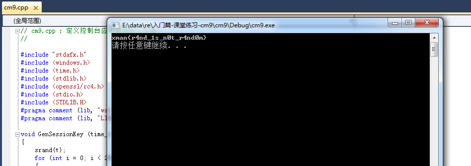

### XMAN 进阶篇-课堂练习-cm1

本题目文件被加壳了。不能直接逆向，需要先脱壳。

PEiD查询加了UPX壳

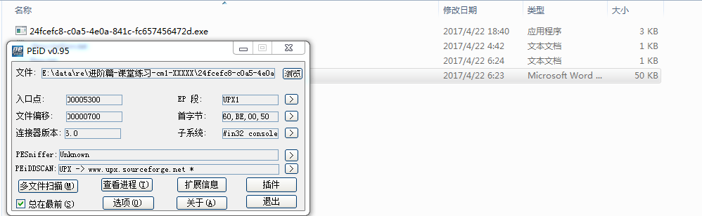

把壳脱掉

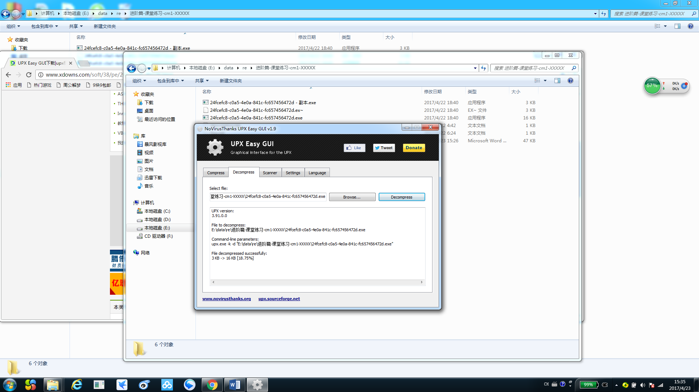

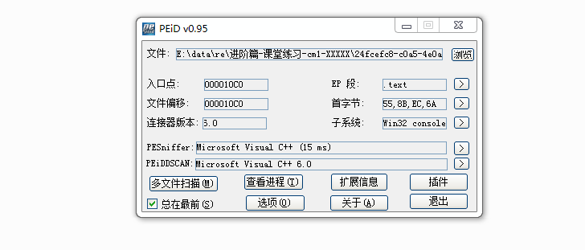

输入字符串和str2相等即可：

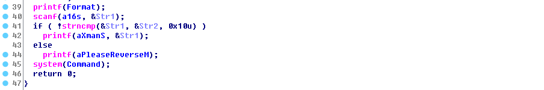

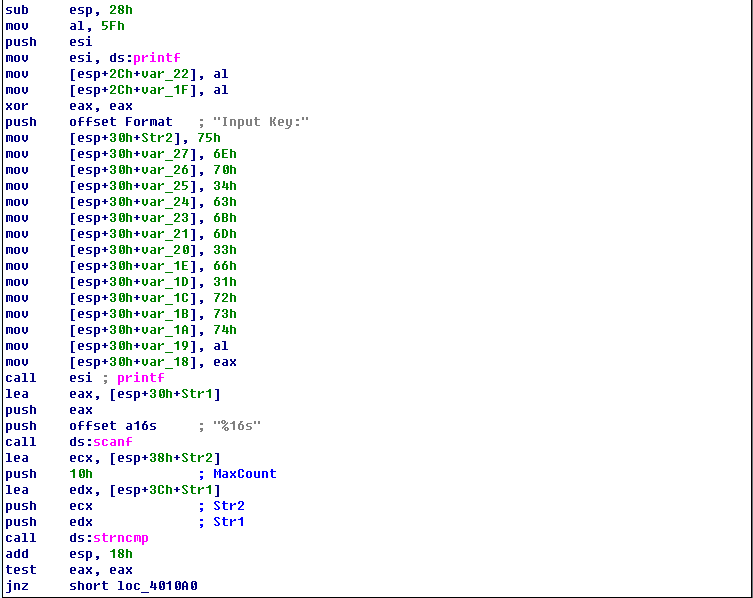

756E7034636B5F6D335F66317273745F

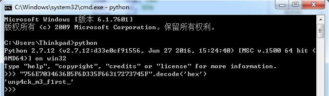

### XMAN 进阶篇-课堂练习-cm3

本题目文件为MFC文件，带界面。我们采用ollydebug进行动态调试。

使用xspy0.4.3可以看到MFC调用过程。或者ollydbg，右键，查找所有参考文本字串

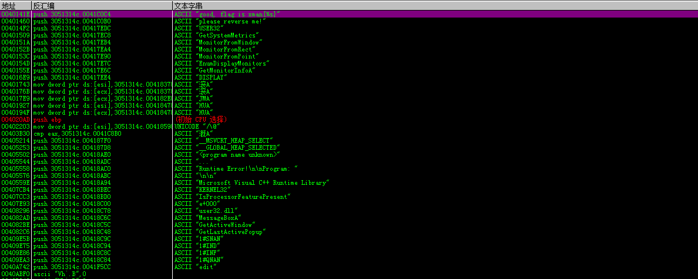

双击后，断点在开始00401370

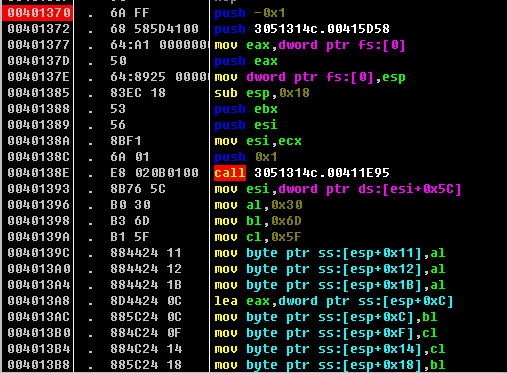

往后调试可以看到flag

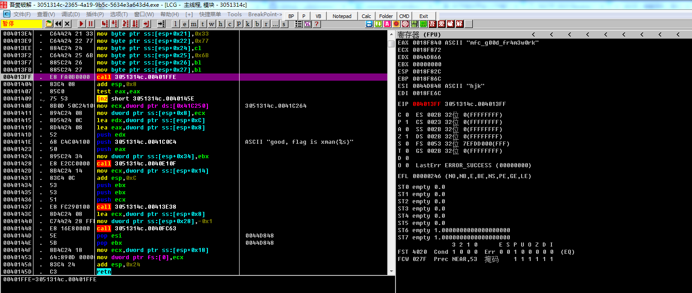

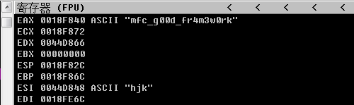

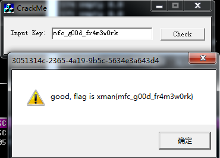

### XMAN 进阶篇-课堂练习-cm4

本题目不再是C, 而是一个dex文件（Android使用）

转成jar文件后，再用java反编译工具可以看到源码。

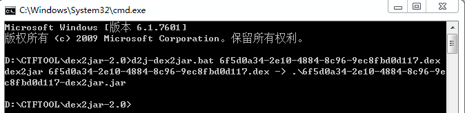


`(5 + 3) * (5 - 3) = 16`

> 备注：后面独立的章节Android逆向中涉及更多的内容。

### XMAN 进阶篇-课堂练习-cm5

本题目也不是C, 而是C#

用PEiD打开，发现是C#程序

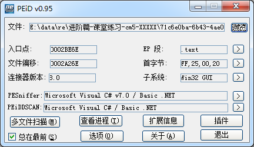

用ILSpy打开查看源码

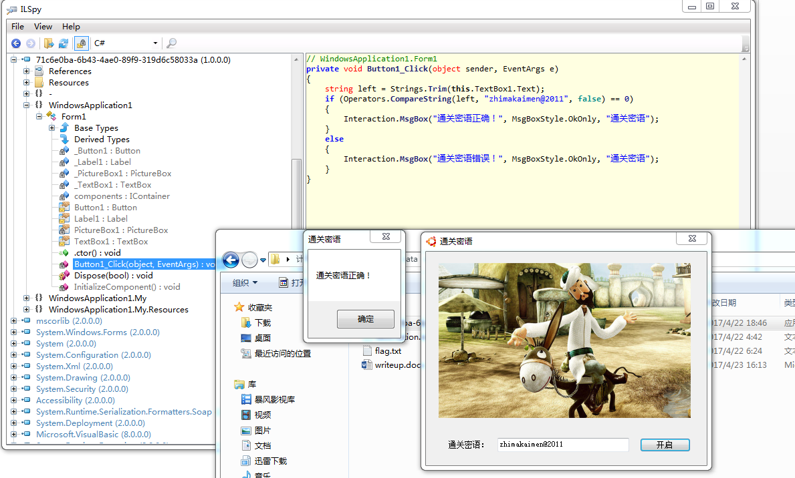

### XMAN 进阶篇-课堂练习-cm6

本题目也不是C, 而是python

程序较大，怀疑是python打包的

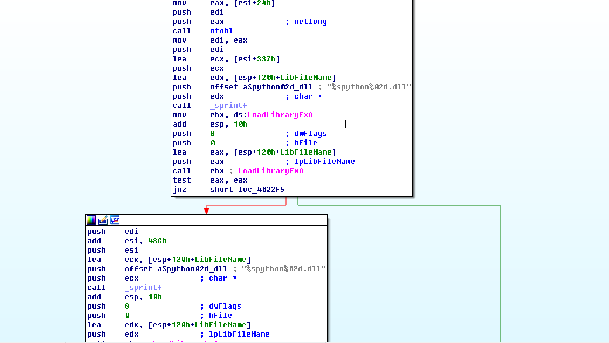

使用pyinstxtractor.py解开：

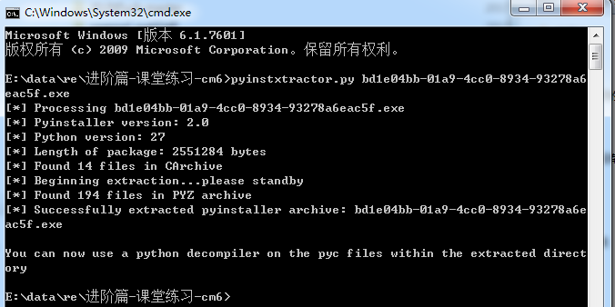

有这样一个文件


仿照着写个代码data替换buf可得到flag

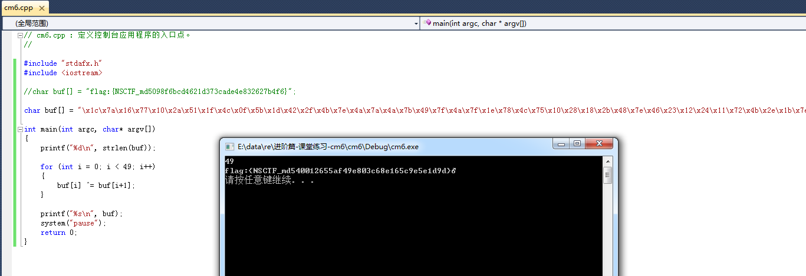

更多参考
http://cugou.github.io/2015/09/28/NSCTF2015-reverse-writeup.html

### XMAN 进阶篇-课堂练习-cm7

本题目与XMAN 入门篇-课堂练习-cm4的不同在于，不是标准的md5算法，初始化参数被更改了。

输入加密后的密文输入正确可以得到flag

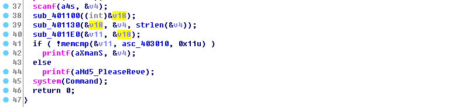

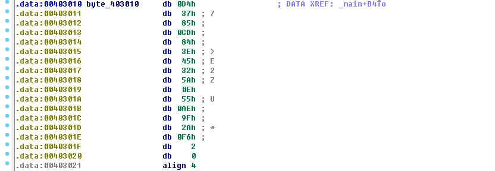

D43785CD843E45325A0E55AE9F2AF602为md5的密文

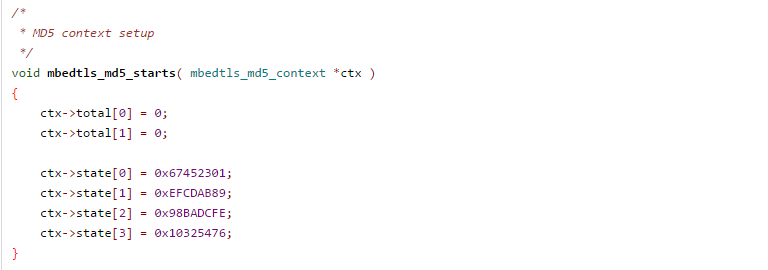

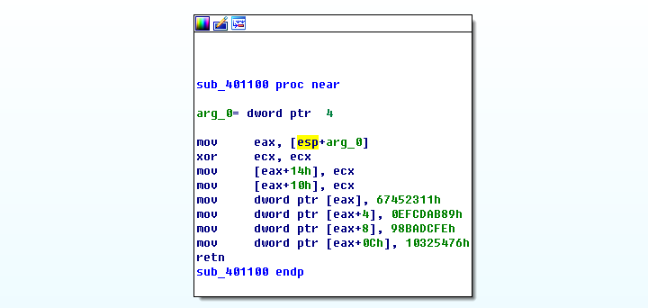

不是标准的md5，第一个参数值0x67452301被修改成了0x67452311

下载一个java的md5源码。修改初始化参数后爆破。4位小写字母和数字的组合可以破解出来。

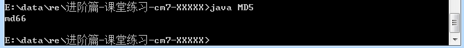

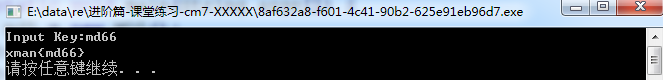

```java
import java.util.List;
import java.util.ArrayList;
public class MD5 {  
  
    static final int S11 = 7;  
    static final int S12 = 12;  
    static final int S13 = 17;  
    static final int S14 = 22;  
  
    static final int S21 = 5;  
    static final int S22 = 9;  
    static final int S23 = 14;  
    static final int S24 = 20;  
  
    static final int S31 = 4;  
    static final int S32 = 11;  
    static final int S33 = 16;  
    static final int S34 = 23;  
  
    static final int S41 = 6;  
    static final int S42 = 10;  
    static final int S43 = 15;  
    static final int S44 = 21;  
  
    static final byte[] PADDING = { -128, 0, 0, 0, 0, 0, 0, 0, 0,  
            0, 0, 0, 0, 0, 0, 0, 0, 0, 0, 0, 0, 0, 0, 0, 0, 0, 0,  
            0, 0, 0, 0, 0, 0, 0, 0, 0, 0, 0, 0, 0, 0, 0, 0, 0, 0,  
            0, 0, 0, 0, 0, 0, 0, 0, 0, 0, 0, 0, 0, 0, 0, 0, 0, 0, 0   
    };  
      
    private long[] state = new long[4];  // state (ABCD)  
    private long[] count = new long[2];  // number of bits, modulo 2^64 (lsb first)  
    private byte[] buffer = new byte[64]; // input buffer  
      
    public String digestHexStr;  
      
    private byte[] digest = new byte[16];  
      
    public String getMD5ofStr(String inbuf) {  
          
        md5Init();  
        md5Update(inbuf.getBytes(), inbuf.length());  
        md5Final();  
        digestHexStr = "";  
        for (int i = 0; i < 16; i++) {  
                digestHexStr += byteHEX(digest[i]);  
        }  
        return digestHexStr;  
  
    }  
      
    public MD5() {  
          
        md5Init();  
        return;  
    }  
      
    private void md5Init() {  
        count[0] = 0L;  
        count[1] = 0L;  
        //state[0] = 0x67452301L;  
		state[0] = 0x67452311L;  
        state[1] = 0xefcdab89L;  
        state[2] = 0x98badcfeL;  
        state[3] = 0x10325476L;  
  
        return;  
    }  
  
    private long F(long x, long y, long z) {  
        return (x & y) | ((~x) & z);  
  
    }  
    private long G(long x, long y, long z) {  
        return (x & z) | (y & (~z));  
  
    }  
    private long H(long x, long y, long z) {  
        return x ^ y ^ z;  
    }  
  
    private long I(long x, long y, long z) {  
        return y ^ (x | (~z));  
    }  
      
    private long FF(long a, long b, long c, long d, long x, long s, long ac) {  
        a += F (b, c, d) + x + ac;  
        a = ((int) a << s) | ((int) a >>> (32 - s));  
        a += b;  
        return a;  
    }  
  
    private long GG(long a, long b, long c, long d, long x, long s, long ac) {  
        a += G (b, c, d) + x + ac;  
        a = ((int) a << s) | ((int) a >>> (32 - s));  
        a += b;  
        return a;  
    }  
    private long HH(long a, long b, long c, long d, long x, long s, long ac) {  
        a += H (b, c, d) + x + ac;  
        a = ((int) a << s) | ((int) a >>> (32 - s));  
        a += b;  
        return a;  
    }  
    private long II(long a, long b, long c, long d, long x, long s, long ac) {  
        a += I (b, c, d) + x + ac;  
        a = ((int) a << s) | ((int) a >>> (32 - s));  
        a += b;  
        return a;  
    }  
      
    private void md5Update(byte[] inbuf, int inputLen) {  
  
        int i, index, partLen;  
        byte[] block = new byte[64];  
        index = (int)(count[0] >>> 3) & 0x3F;  
        if ((count[0] += (inputLen << 3)) < (inputLen << 3))  
             count[1]++;  
        count[1] += (inputLen >>> 29);  
  
        partLen = 64 - index;  
  
        if (inputLen >= partLen) {  
            md5Memcpy(buffer, inbuf, index, 0, partLen);  
            md5Transform(buffer);  
  
            for (i = partLen; i + 63 < inputLen; i += 64) {  
  
                    md5Memcpy(block, inbuf, 0, i, 64);  
                    md5Transform (block);  
            }  
            index = 0;  
  
        } else  
  
            i = 0;  
  
        md5Memcpy(buffer, inbuf, index, i, inputLen - i);  
  
    }  
      
    private void md5Final () {  
        byte[] bits = new byte[8];  
        int index, padLen;  
  
        Encode (bits, count, 8);  
  
        index = (int)(count[0] >>> 3) & 0x3f;  
        padLen = (index < 56) ? (56 - index) : (120 - index);  
        md5Update (PADDING, padLen);  
  
        md5Update(bits, 8);  
  
        Encode (digest, state, 16);  
  
    }  
      
    private void md5Memcpy (byte[] output, byte[] input, int outpos, int inpos, int len) {  
        int i;  
        for (i = 0; i < len; i++)  
            output[outpos + i] = input[inpos + i];  
    }  
      
    private void md5Transform (byte block[]) {  
        long a = state[0], b = state[1], c = state[2], d = state[3];  
        long[] x = new long[16];  
  
        Decode (x, block, 64);  
  
        /* Round 1 */  
        a = FF (a, b, c, d, x[0], S11, 0xd76aa478L); /* 1 */  
        d = FF (d, a, b, c, x[1], S12, 0xe8c7b756L); /* 2 */  
        c = FF (c, d, a, b, x[2], S13, 0x242070dbL); /* 3 */  
        b = FF (b, c, d, a, x[3], S14, 0xc1bdceeeL); /* 4 */  
        a = FF (a, b, c, d, x[4], S11, 0xf57c0fafL); /* 5 */  
        d = FF (d, a, b, c, x[5], S12, 0x4787c62aL); /* 6 */  
        c = FF (c, d, a, b, x[6], S13, 0xa8304613L); /* 7 */  
        b = FF (b, c, d, a, x[7], S14, 0xfd469501L); /* 8 */  
        a = FF (a, b, c, d, x[8], S11, 0x698098d8L); /* 9 */  
        d = FF (d, a, b, c, x[9], S12, 0x8b44f7afL); /* 10 */  
        c = FF (c, d, a, b, x[10], S13, 0xffff5bb1L); /* 11 */  
        b = FF (b, c, d, a, x[11], S14, 0x895cd7beL); /* 12 */  
        a = FF (a, b, c, d, x[12], S11, 0x6b901122L); /* 13 */  
        d = FF (d, a, b, c, x[13], S12, 0xfd987193L); /* 14 */  
        c = FF (c, d, a, b, x[14], S13, 0xa679438eL); /* 15 */  
        b = FF (b, c, d, a, x[15], S14, 0x49b40821L); /* 16 */  
  
        /* Round 2 */  
        a = GG (a, b, c, d, x[1], S21, 0xf61e2562L); /* 17 */  
        d = GG (d, a, b, c, x[6], S22, 0xc040b340L); /* 18 */  
        c = GG (c, d, a, b, x[11], S23, 0x265e5a51L); /* 19 */  
        b = GG (b, c, d, a, x[0], S24, 0xe9b6c7aaL); /* 20 */  
        a = GG (a, b, c, d, x[5], S21, 0xd62f105dL); /* 21 */  
        d = GG (d, a, b, c, x[10], S22, 0x2441453L); /* 22 */  
        c = GG (c, d, a, b, x[15], S23, 0xd8a1e681L); /* 23 */  
        b = GG (b, c, d, a, x[4], S24, 0xe7d3fbc8L); /* 24 */  
        a = GG (a, b, c, d, x[9], S21, 0x21e1cde6L); /* 25 */  
        d = GG (d, a, b, c, x[14], S22, 0xc33707d6L); /* 26 */  
        c = GG (c, d, a, b, x[3], S23, 0xf4d50d87L); /* 27 */  
        b = GG (b, c, d, a, x[8], S24, 0x455a14edL); /* 28 */  
        a = GG (a, b, c, d, x[13], S21, 0xa9e3e905L); /* 29 */  
        d = GG (d, a, b, c, x[2], S22, 0xfcefa3f8L); /* 30 */  
        c = GG (c, d, a, b, x[7], S23, 0x676f02d9L); /* 31 */  
        b = GG (b, c, d, a, x[12], S24, 0x8d2a4c8aL); /* 32 */  
  
        /* Round 3 */  
        a = HH (a, b, c, d, x[5], S31, 0xfffa3942L); /* 33 */  
        d = HH (d, a, b, c, x[8], S32, 0x8771f681L); /* 34 */  
        c = HH (c, d, a, b, x[11], S33, 0x6d9d6122L); /* 35 */  
        b = HH (b, c, d, a, x[14], S34, 0xfde5380cL); /* 36 */  
        a = HH (a, b, c, d, x[1], S31, 0xa4beea44L); /* 37 */  
        d = HH (d, a, b, c, x[4], S32, 0x4bdecfa9L); /* 38 */  
        c = HH (c, d, a, b, x[7], S33, 0xf6bb4b60L); /* 39 */  
        b = HH (b, c, d, a, x[10], S34, 0xbebfbc70L); /* 40 */  
        a = HH (a, b, c, d, x[13], S31, 0x289b7ec6L); /* 41 */  
        d = HH (d, a, b, c, x[0], S32, 0xeaa127faL); /* 42 */  
        c = HH (c, d, a, b, x[3], S33, 0xd4ef3085L); /* 43 */  
        b = HH (b, c, d, a, x[6], S34, 0x4881d05L); /* 44 */  
        a = HH (a, b, c, d, x[9], S31, 0xd9d4d039L); /* 45 */  
        d = HH (d, a, b, c, x[12], S32, 0xe6db99e5L); /* 46 */  
        c = HH (c, d, a, b, x[15], S33, 0x1fa27cf8L); /* 47 */  
        b = HH (b, c, d, a, x[2], S34, 0xc4ac5665L); /* 48 */  
  
        /* Round 4 */  
        a = II (a, b, c, d, x[0], S41, 0xf4292244L); /* 49 */  
        d = II (d, a, b, c, x[7], S42, 0x432aff97L); /* 50 */  
        c = II (c, d, a, b, x[14], S43, 0xab9423a7L); /* 51 */  
        b = II (b, c, d, a, x[5], S44, 0xfc93a039L); /* 52 */  
        a = II (a, b, c, d, x[12], S41, 0x655b59c3L); /* 53 */  
        d = II (d, a, b, c, x[3], S42, 0x8f0ccc92L); /* 54 */  
        c = II (c, d, a, b, x[10], S43, 0xffeff47dL); /* 55 */  
        b = II (b, c, d, a, x[1], S44, 0x85845dd1L); /* 56 */  
        a = II (a, b, c, d, x[8], S41, 0x6fa87e4fL); /* 57 */  
        d = II (d, a, b, c, x[15], S42, 0xfe2ce6e0L); /* 58 */  
        c = II (c, d, a, b, x[6], S43, 0xa3014314L); /* 59 */  
        b = II (b, c, d, a, x[13], S44, 0x4e0811a1L); /* 60 */  
        a = II (a, b, c, d, x[4], S41, 0xf7537e82L); /* 61 */  
        d = II (d, a, b, c, x[11], S42, 0xbd3af235L); /* 62 */  
        c = II (c, d, a, b, x[2], S43, 0x2ad7d2bbL); /* 63 */  
        b = II (b, c, d, a, x[9], S44, 0xeb86d391L); /* 64 */  
  
        state[0] += a;  
        state[1] += b;  
        state[2] += c;  
        state[3] += d;  
  
    }  
      
    private void Encode (byte[] output, long[] input, int len) {  
        int i, j;  
  
        for (i = 0, j = 0; j < len; i++, j += 4) {  
            output[j] = (byte)(input[i] & 0xffL);  
            output[j + 1] = (byte)((input[i] >>> 8) & 0xffL);  
            output[j + 2] = (byte)((input[i] >>> 16) & 0xffL);  
            output[j + 3] = (byte)((input[i] >>> 24) & 0xffL);  
        }  
    }  
  
    private void Decode (long[] output, byte[] input, int len) {  
        int i, j;  
        for (i = 0, j = 0; j < len; i++, j += 4)  
            output[i] = b2iu(input[j]) |  
                       (b2iu(input[j + 1]) << 8) |  
                       (b2iu(input[j + 2]) << 16) |  
                       (b2iu(input[j + 3]) << 24);  
  
        return;  
    }  
     
    public static long b2iu(byte b) {  
        return b < 0 ? b & 0x7F + 128 : b;  
    }  
      
    public static String byteHEX(byte ib) {  
        char[] Digit = { '0','1','2','3','4','5','6','7','8','9',  
        'A','B','C','D','E','F' };  
        char [] ob = new char[2];  
        ob[0] = Digit[(ib >>> 4) & 0X0F];  
        ob[1] = Digit[ib & 0X0F];  
        String s = new String(ob);  
        return s;  
    }  
	
  public static void main(String args[]) {
	  MD5 md5 = new MD5();
	  List<String> lowerList = new ArrayList<String>();
	  List<String> upperList = new ArrayList<String>();
	  List<String> numberList = new ArrayList<String>();
	  for (int i = 0x30; i <= 0x39; i++) {
		  numberList.add(String.valueOf((char)i));
	  }
	  for (int i = 0x41; i <= 0x5a; i++) {
		  upperList.add(String.valueOf((char)i));
	  }
	  for (int i = 0x61; i <= 0x7a; i++) {
		  lowerList.add(String.valueOf((char)i));
	  }
	  List<String> lowerNumberList = new ArrayList<String>();
      lowerNumberList.addAll(lowerList);
      lowerNumberList.addAll(numberList);
	  StringBuilder sb = new StringBuilder();
	  for (int a = 0; a < lowerNumberList.size(); a++) {
		  for (int b = 0; b < lowerNumberList.size(); b++) {
			  for (int c = 0; c < lowerNumberList.size(); c++) {
				  for (int d = 0; d < lowerNumberList.size(); d++) {
					  sb.append(lowerNumberList.get(a)).append(lowerNumberList.get(b)).append(lowerNumberList.get(c)).append(lowerNumberList.get(d));
					  String s = md5.getMD5ofStr(sb.toString());
					  if ("D43785CD843E45325A0E55AE9F2AF602".equals(s)) {
						  //System.out.println("enter");
						  System.out.println(sb.toString());
					  }
					  sb = new StringBuilder();
				  }
			  }
		  }
	  }	  
  }
}
```

### XMAN 进阶篇-课堂练习-cm8

本题目需要去掉一些混淆后，才能F5。然后是一个方程组求解

输入13个字符，调用checkSolution函数检查。

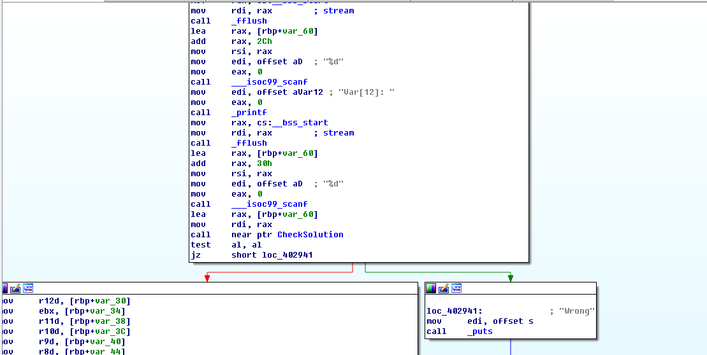

F5失败

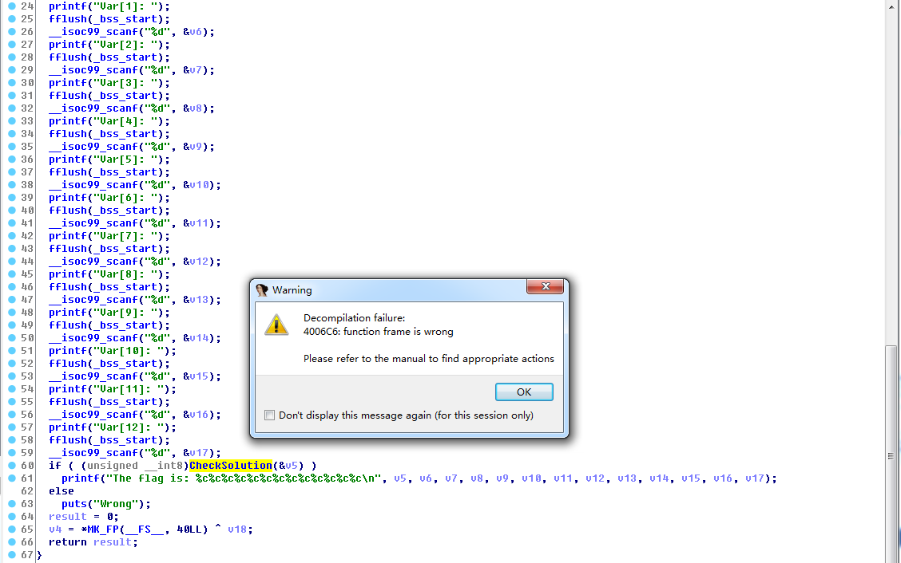

发现很多jump跳过了无效指令

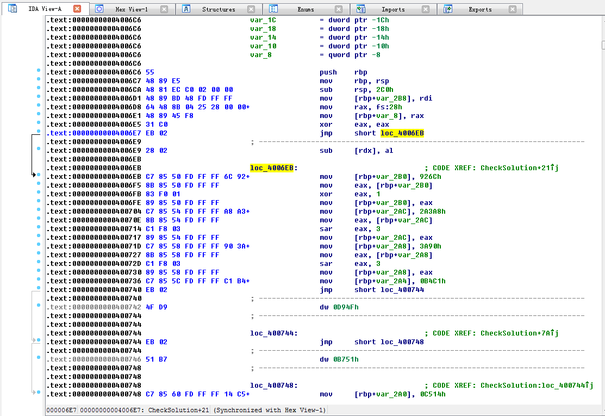

编写程序清除掉：
```python
elf = open('1426e5be-5343-4ab2-8915-322b0591e948.CrackMe8', 'rb').read()

ank = '\xeb\x02'
idx = 0x6c6
while idx < 0x25e7:
	idx = elf.find(ank, idx)
	if idx == -1 or idx >= 0x25e7:
		break
	elf = elf[:idx] + '\x90\x90\x90\x90' + elf[idx+4:]
	idx += 4

open('re_new', 'wb').write(elf)
```
都给nop掉了

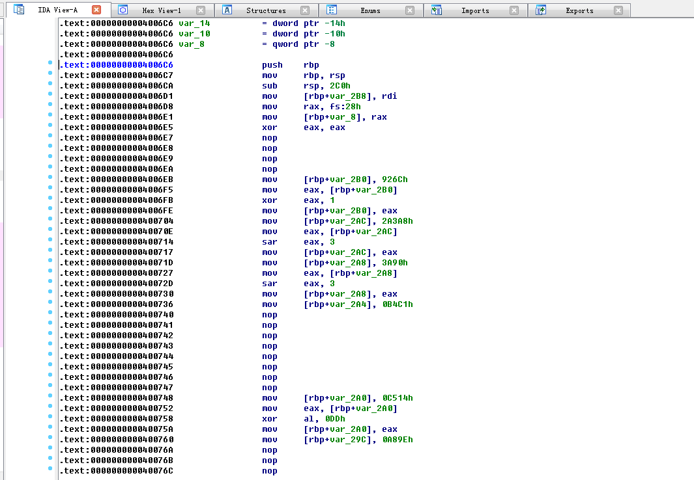

然后F5可见反汇编，多元方程组求解问题。

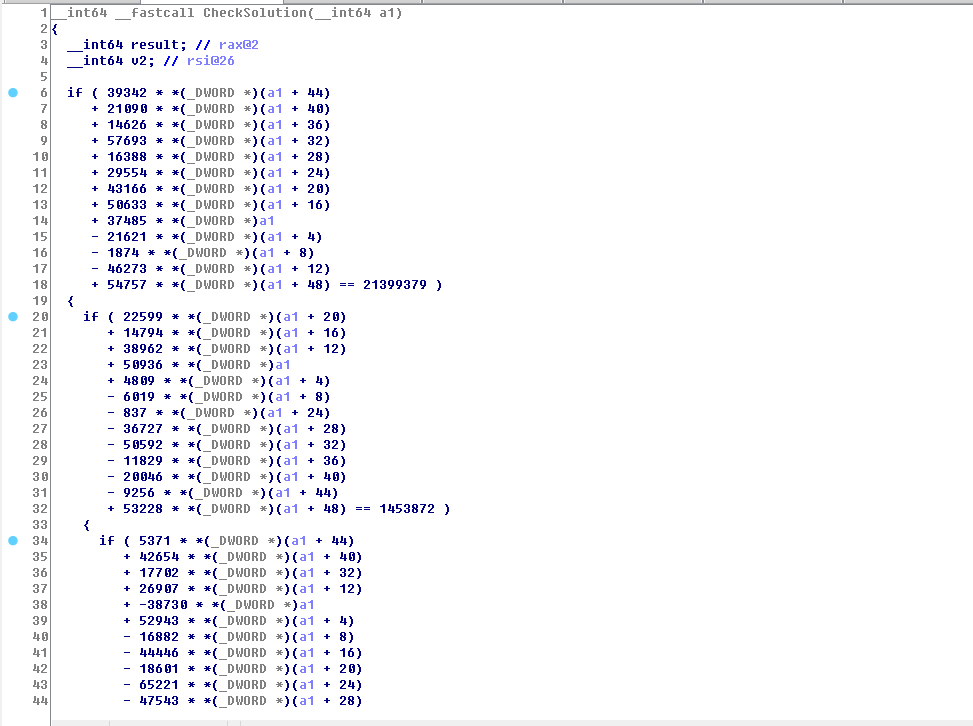

写python脚本将系数都提取出来。
```python
# -*- coding: utf-8 -*-
from __future__ import print_function
lines = open('input.c', 'r').readlines() # 这是CheckSolution函数的反编译结果再简单处理下，去掉数据无关代码

arr_left = ""
arr_right = ""
arrs = []
cur_exp = []
for l in lines:
	l = l.strip()
	if ''==l or '{' in l or '__int64' in l or 'MK_FP' in l or 'result' in l or '}' in l or 'else' in l:
		continue
	
	#print(l)
	if l.startswith('if ('):
		l = l[4:]
		if cur_exp:
			print("[", end='')
			arr_left += "["
			for key_idx, value in sorted(cur_exp.items()):
				print("%s, " % value, end='')
				arr_left += value + ','
			
			print("]")
			arr_left += "],"
			
		cur_exp = {}
		
	if '==' in l:
		idx = l.find('==')
		result = l[idx+3:-1]
		l = l[:idx]
		print ("result = " + result)
		arr_right += result + ","
		
	sign = "+"
	if l[0] == '-':
		sign = '-'
		
	if l[0] in ['-','+']:
		l = l[1:]
		
	#print(l)
	fields = l.split('*')
	#print(fields)
	a1_idx = 0
	if '+' in fields[3]:
		a1_idx = int(fields[3].split('+')[1].split(')')[0].strip())
	#a1_idx = int(fields[1].split('[]')[1].split(']')[0])
	#print(a1_idx)
	cur_exp[a1_idx] = sign+fields[0].strip()
	#print(cur_exp[a1_idx])
	
	
if cur_exp:
	print("[", end='')
	arr_left += "["
	for key_idx, value in sorted(cur_exp.items()):#打印时按下标排序
		print("%s, " % value, end='')
		arr_left += value + ','
		
	print("]")
	arr_left += "]"
	
print(arr_left)
print(arr_right)
```
```
[+37485,-21621,-1874,-46273,+50633,+43166,+29554,+16388,+57693,+14626,+21090,+39342,+54757,],[+50936,+4809,-6019,+38962,+14794,+22599,-837,-36727,-50592,-11829,-20046,-9256,+53228,],[+-38730,+52943,-16882,+26907,-44446,-18601,-65221,-47543,+17702,-33910,+42654,+5371,+11469,],[+57747,-23889,-26016,-25170,+54317,-32337,+10649,+34805,-9171,-22855,+8621,-634,-11864,],[+-14005,+16323,+43964,+34670,+54889,-6141,-35427,-61977,+28134,+43186,-59676,+15578,+50082,],[+-40760,-22014,+13608,-4946,-26750,-31708,+39603,+13602,-59055,-32738,+29341,+10305,-15650,],[+-47499,+57856,+13477,-10219,-5032,-21039,-29607,+55241,-6065,+16047,-4554,-2262,+18903,],[+-65419,+17175,-9410,-22514,-52377,-9235,+53309,+47909,-59111,-41289,-24422,+41178,-23447,],[+1805,+4135,-16900,+33381,+46767,+58551,-34118,-44920,-11933,-20530,+15699,-36597,+18231,],[+-42941,+61056,-45169,+41284,-1722,-26423,+47052,+42363,+15033,+18975,+10788,-33319,+63680,],[+-37085,-51590,-17798,-10127,-52388,+12746,+12587,+58786,-8269,+22613,+30753,-20853,+32216,],[+36650,+47566,-33282,-59180,+65196,+9228,-59599,-62888,+48719,+47348,-37592,+57612,+40510,],[+51735,+35879,-63890,+4102,+59511,-21386,-20769,+26517,+28153,+25252,-43789,+25633,+7314,]
21399379 ,1453872 ,-5074020 ,-5467933 ,7787144 ,-8863847 ,-747805 ,-11379056 ,-166140 ,9010363 ,-4169825 ,4081505 ,1788229,
```

然后编写python脚本矩阵求解
```python
a = np.array([[+37485,-21621,-1874,-46273,+50633,+43166,+29554,+16388,+57693,+14626,+21090,+39342,+54757,],[+50936,+4809,-6019,+38962,+14794,+22599,-837,-36727,-50592,-11829,-20046,-9256,+53228,],[+-38730,+52943,-16882,+26907,-44446,-18601,-65221,-47543,+17702,-33910,+42654,+5371,+11469,],[+57747,-23889,-26016,-25170,+54317,-32337,+10649,+34805,-9171,-22855,+8621,-634,-11864,],[+-14005,+16323,+43964,+34670,+54889,-6141,-35427,-61977,+28134,+43186,-59676,+15578,+50082,],[+-40760,-22014,+13608,-4946,-26750,-31708,+39603,+13602,-59055,-32738,+29341,+10305,-15650,],[+-47499,+57856,+13477,-10219,-5032,-21039,-29607,+55241,-6065,+16047,-4554,-2262,+18903,],[+-65419,+17175,-9410,-22514,-52377,-9235,+53309,+47909,-59111,-41289,-24422,+41178,-23447,],[+1805,+4135,-16900,+33381,+46767,+58551,-34118,-44920,-11933,-20530,+15699,-36597,+18231,],[+-42941,+61056,-45169,+41284,-1722,-26423,+47052,+42363,+15033,+18975,+10788,-33319,+63680,],[+-37085,-51590,-17798,-10127,-52388,+12746,+12587,+58786,-8269,+22613,+30753,-20853,+32216,],[+36650,+47566,-33282,-59180,+65196,+9228,-59599,-62888,+48719,+47348,-37592,+57612,+40510,],[+51735,+35879,-63890,+4102,+59511,-21386,-20769,+26517,+28153,+25252,-43789,+25633,+7314,]])
b = np.array([21399379 ,1453872 ,-5074020 ,-5467933 ,7787144 ,-8863847 ,-747805 ,-11379056 ,-166140 ,9010363 ,-4169825 ,4081505 ,1788229,])
x = solve(a, b)
print(x)
result = [77,97,116,104,32,105,115,32,104,97,114,100,33]
s = ""
for i in result:
	s = s + chr(i)
print s
#Math is hard!
```
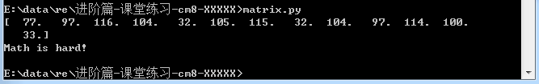

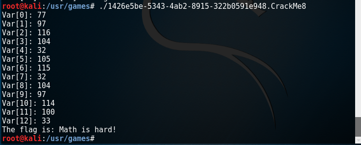

### bin100(ebCTF 2013)

本题目使用动态调试，使用ollydbg修改打补丁。

Od打开


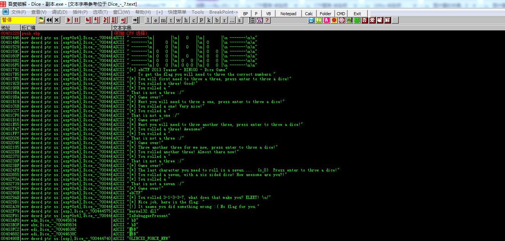

几次结果必须是3 1 3 3 7才行，比中500w还难。必须修改程序。
Z给改成1可以过去，每次都改成1

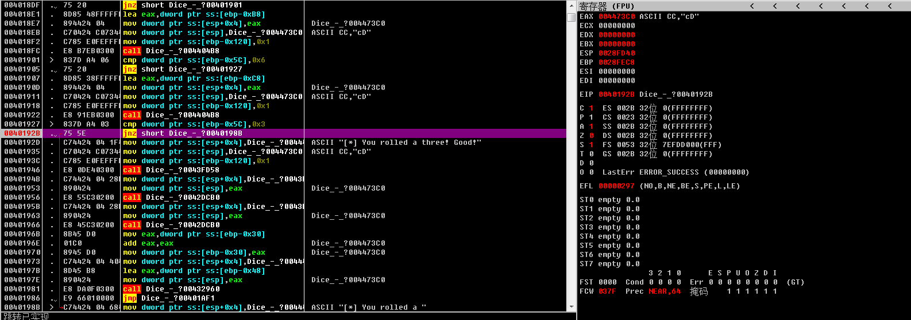

但最后没出来flag

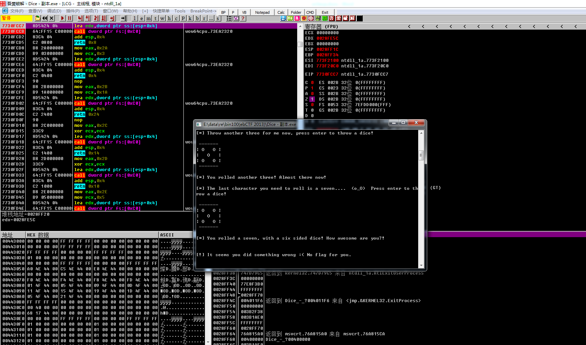

几次都给nop掉好了

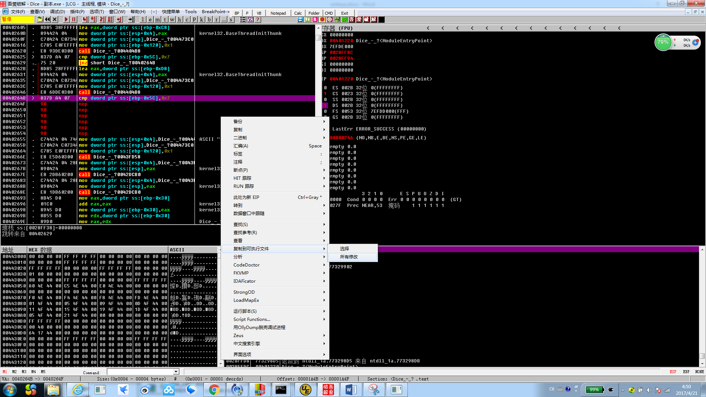

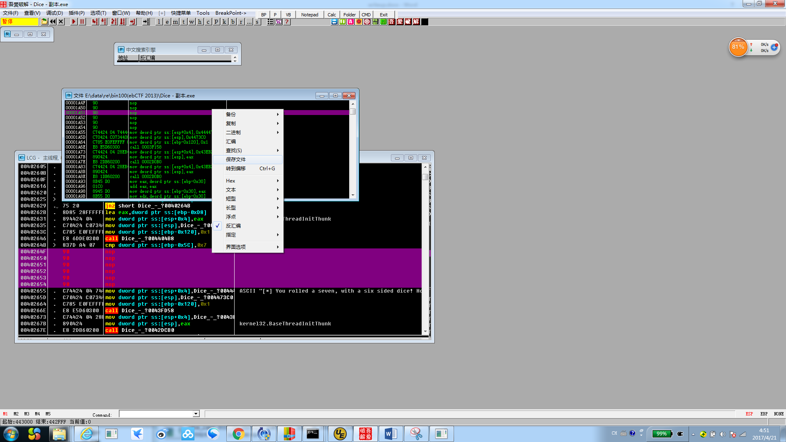

生成Dice_2.exe运行

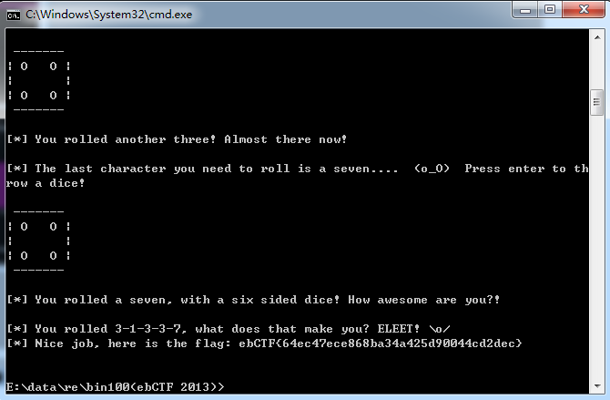


