## 3.1 Android逆向

本节介绍Android逆向的常用手段。

### java分析

示例: basic

所有的逻辑全在java中

密码应该是str1, str1由getTableFromPic和getPwdFromPic的结果计算得到

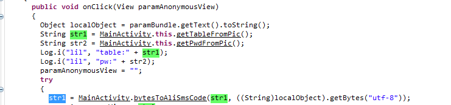

编写java代码解出结果

```java
import java.io.*;

public class BasicTest {
  protected String getTableFromPic()
  {
    InputStream is = null;
	String value = "";
	try {
        is = new FileInputStream("logo.png");
        int length = is.available();
        byte[] b = new byte[length];
        is.read(b, 0, length);
        byte[] data = new byte[768];
        System.arraycopy(b, 89473, data, 0, 768);
        String value2 = new String(data, "utf-8");
		is.close();
		return value2;
      }
      catch (Exception e)
      {
      }
    return value;
  }
  protected String getPwdFromPic() {
	  InputStream is = null;
	String value = "";
	try {
        is = new FileInputStream("logo.png");
        int length = is.available();
        byte[] b = new byte[length];
        is.read(b, 0, length);
        byte[] data = new byte[18];
        System.arraycopy(b, 91265, data, 0, 18);
        String value2 = new String(data, "utf-8");
		is.close();
		return value2;
      }
      catch (Exception e)
      {
      }
    return value;
  }
    private static String bytesToAliSmsCode(String paramString, byte[] paramArrayOfByte)
  {
    StringBuilder localStringBuilder = new StringBuilder();
    for (int i = 0;; i++)
    {
      if (i >= paramArrayOfByte.length) {
        return localStringBuilder.toString();
      }
      localStringBuilder.append(paramString.charAt(paramArrayOfByte[i] & 0xFF));
    }
  }
  
  private byte[] crack(String table, String pwd) {
	  int pwdLength = pwd.length();
	  int tableLength = table.length();
	  byte[] data = new byte[pwdLength];
	  for (int i=0;i<pwdLength;i++) {
		  char p = pwd.charAt(i);
		  for (byte j =0;j<tableLength;j++) {
			  if(table.charAt(j) == p) {
				  data[i] = j;
				  break;
			  }
		  }
	  }
	  return data;
  }
  
  public static void main(String args[]) {
	  BasicTest t = new BasicTest();
	  String pwd = t.getPwdFromPic();
	  String table = t.getTableFromPic();
	  byte data[] = t.crack(table, pwd);
	  String result = new String();
	  try {
		  result = new String(data, "utf-8");
	  } catch (Exception e) {
		  System.out.println("error happened....");
	  }
	  System.out.println(result);
  }
	
}

```

```
E:\data\mobile\basic>javac BasicTest.java

E:\data\mobile\basic>java BasicTest
581026
```

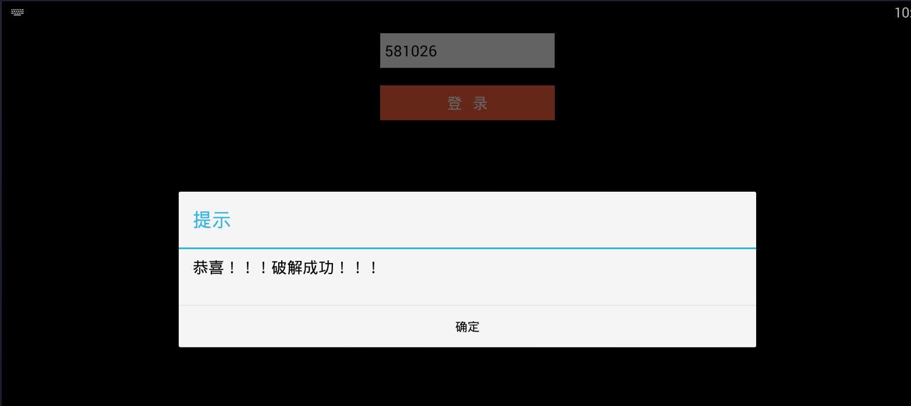


### js分析

示例：js

check()函数处理

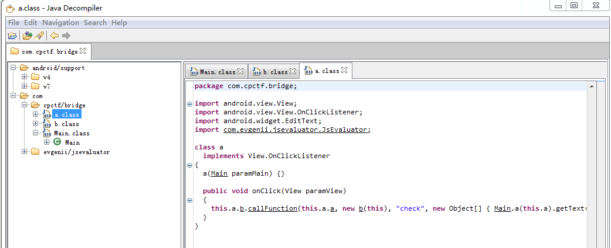

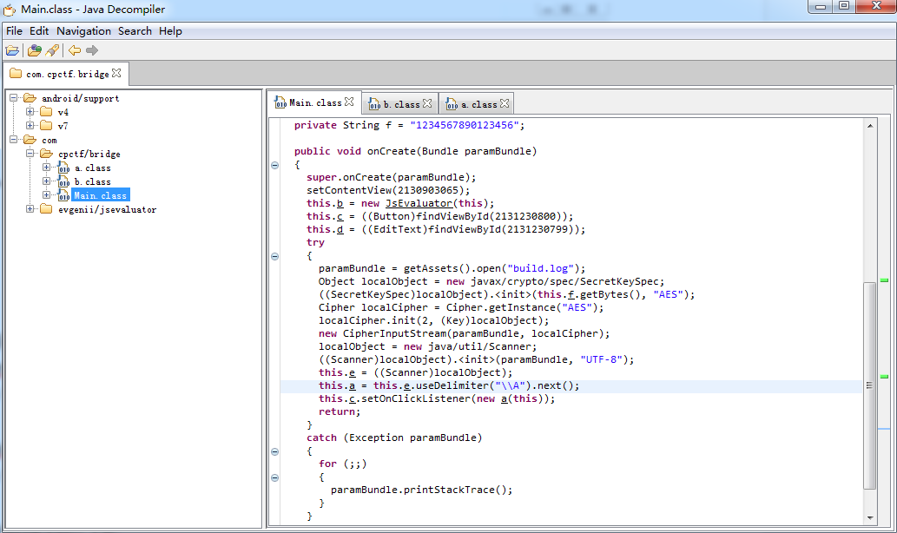

build.log 包含jsfuck代码

下载JSUNFuck.exe解码

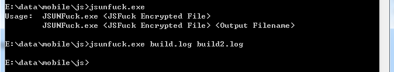

```javascript
function check(input){
    if(input.length != 29){
       return "Wrong";
    }
    if(input.slice(0,6) != 'Xman_{'){
       return "Wrong";
    }
    if(input.slice(28,29)!= '}'){
       return "Wrong";
    }
    input = input.slice(6,28);

    var v = input.split('').map(function(x){return x[0].charCodeAt(0)});var k = [101, 120, 99, 105, 116, 101, 100, 101, 120, 99, 105, 116, 101, 100, 101, 120, 99, 105, 116, 101, 100, 101 ];var f = [][filter][constructor];var m = f('a', 'b', r=0;while(a != 0){if(a&1){r = r ^ b;}t = b & 0x80;b = b << 1;if(b & 0x100){b = (b ^ 0xd7) & 0xff;}a = a >> 1;}return r;);
var z  = f('a', 'b', 'var c = [];for(var i=0/*‮*/; i<a.length; i++){c.push([a[i], b[i]]);}return c;' );‬
    var r = z(v, k).map(function(tu){return m(tu[0], tu[1]);}).reduce(function(x,y){return x.concat(x.slice(-1)[0] ^ y);} , [0]);
    for (var i = 0; i < r.length; i++) {
	if(r[i] == [0, 215, 183, 13, 77, 180, 24, 191, 255, 85, 89, 0, 221, 180, 248, 166, 67, 210, 225, 178, 242, 84, 248][i]){
            continue;
        }
        else{
            return "Wrong!"
        }
    }
    return "You Win"
}
```

爆破

```html
<html>
<head>
<script>
function check(){
	//alert(1);
    /*if(input.length != 29){
       return "Wrong";
    }
    if(input.slice(0,6) != 'Xman_{'){
       return "Wrong";
    }
    if(input.slice(28,29)!= '}'){
       return "Wrong";
    } */
	count = 0;
    input = "";
	while (count < 22) {
		for (j=0;j<128;j++) {
			flag = 1;
			tem = input + String.fromCharCode(j);
			
			var v = tem.split('').map(function(x){return x[0].charCodeAt(0)});
			var k = [101, 120, 99, 105, 116, 101, 100, 101, 120, 99, 105, 116, 101, 100, 101, 120, 99, 105, 116, 101, 100, 101 ];
			//var f = [][filter][constructor];
			var m = function t(a,b){r=0;while(a != 0){if(a&1){r = r ^ b;}t = b & 0x80;b = b << 1;if(b & 0x100){b = (b ^ 0xd7) & 0xff;}a = a >> 1;}return r;}
			var z = function t(a,b){var c = [];for(var i=0/*?*/; i<a.length; i++){c.push([a[i], b[i]]);}return c;}
			var r = z(v, k).map(function(tu){return m(tu[0], tu[1]);}).reduce(function(x,y){return x.concat(x.slice(-1)[0] ^ y);} , [0]);
			for (var i = 0; i < r.length; i++) {
				if(r[i] == [0, 215, 183, 13, 77, 180, 24, 191, 255, 85, 89, 0, 221, 180, 248, 166, 67, 210, 225, 178, 242, 84, 248][i]){
					continue;
				}
				else{
					flag = 0;
					break;
				}
			}
			//return "You Win"
			if (flag==1) {
				input = tem;
			}
		}
		count = count + 1;
	}
    alert(input);
}
</script>
</head>
<body>
<button type="button" onclick="check()">Try it</button>
</body>
</html>
```

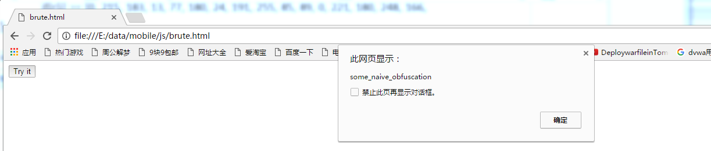

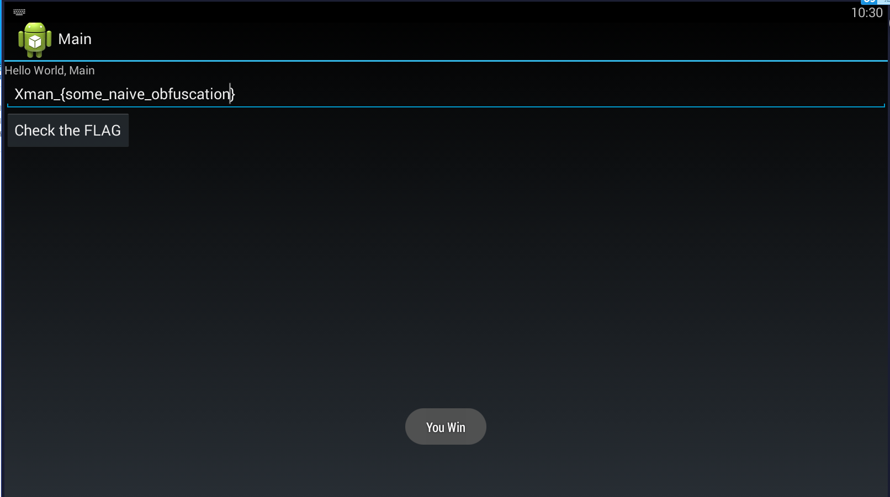


### 修改smali文件打包

示例1： 热身运动-爬楼梯

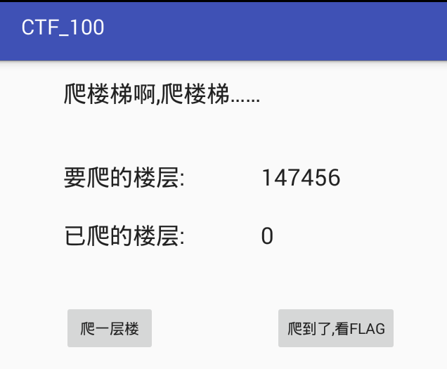

一次只能1层

初始层数为16384的整数倍，不大于32倍

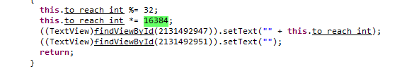

一个思路是给修改成一次16384层

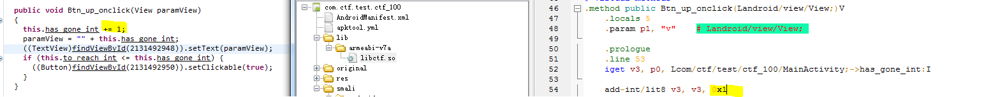

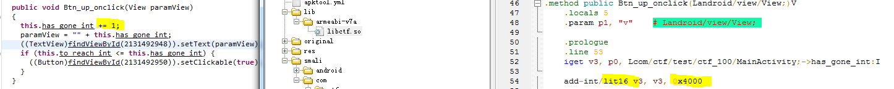

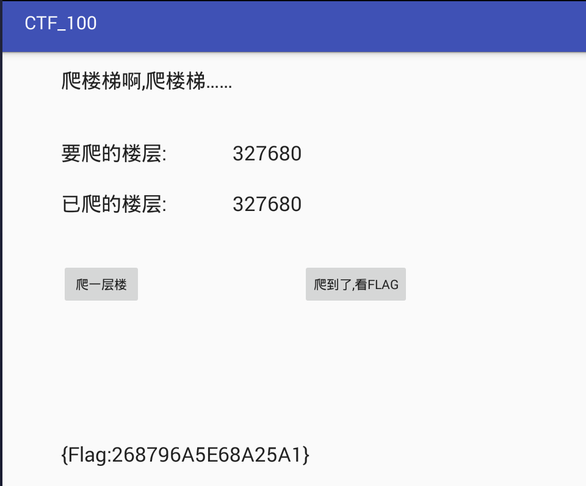

示例2： timemachine

打开程序，一直显示Fun in CTF，需要时间走完出flag

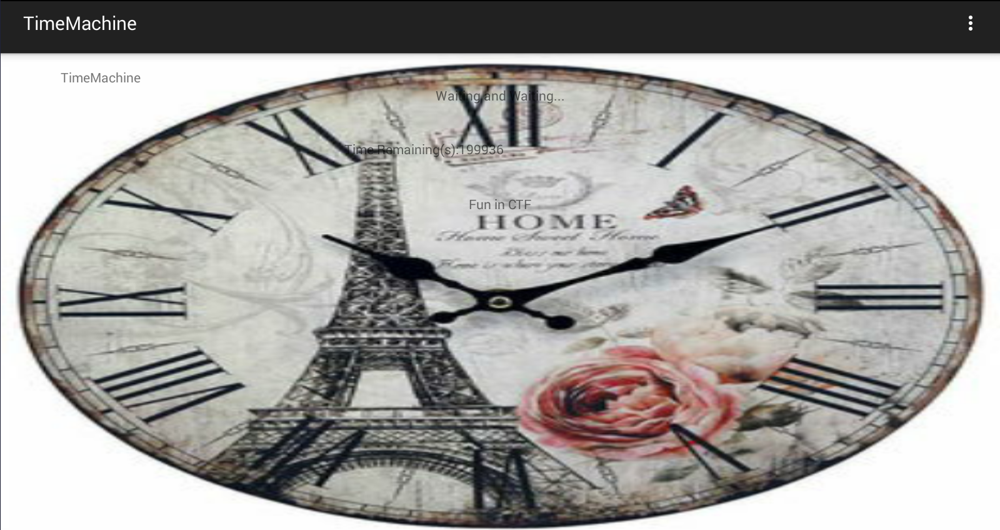

调用本地函数计算flag，这个k在一直变化，只要计算出来带进去即可。

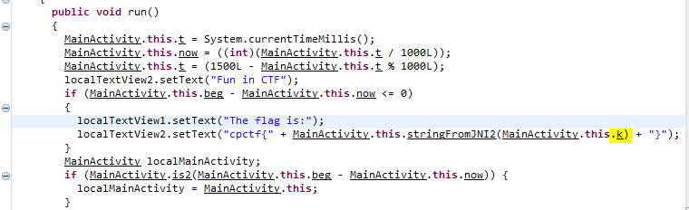

通过k的相关逻辑

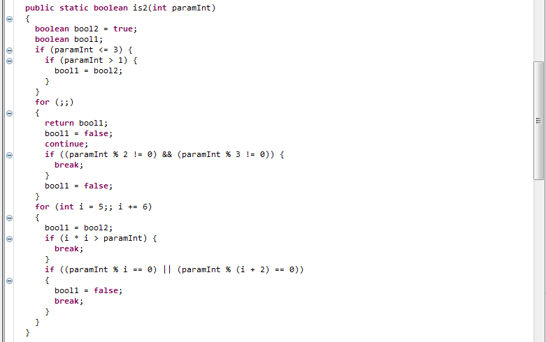

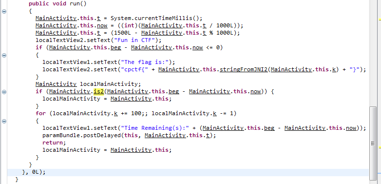

分析k值是这样变化的：

Is2返回true或false，true的话k加上100，false的话k减去1，200000次计算后得出结果。编写代码如下计算k值：

Test.java

```java
public class Test {
		
	public static boolean is2(int n) {
		if (n <= 3) {
			if (n > 1) {
				return true;
			}
			return false;
		} else if (n % 2 == 0 || n % 3 == 0) {
			return false;
		} else {
			int i = 5;
			while (i * i <= n) {
				if (n % i == 0 || n % (i + 2) == 0) {
					return false;
				}
				i += 6;
			}
			return true;
		}
	}
	
	public static void main(String args[]) {
		int count = Integer.parseInt(args[0]);
		int k = 0;
		while (count > 0) {
			if (is2(count)) {
				k += 100;
			} else {
				k--;
			}
			count--;
		}
		System.out.println(k);
	}
}
```

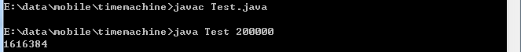

K值结果为1616384
修改smali，时间从200000修改为3，k值固定为1616384

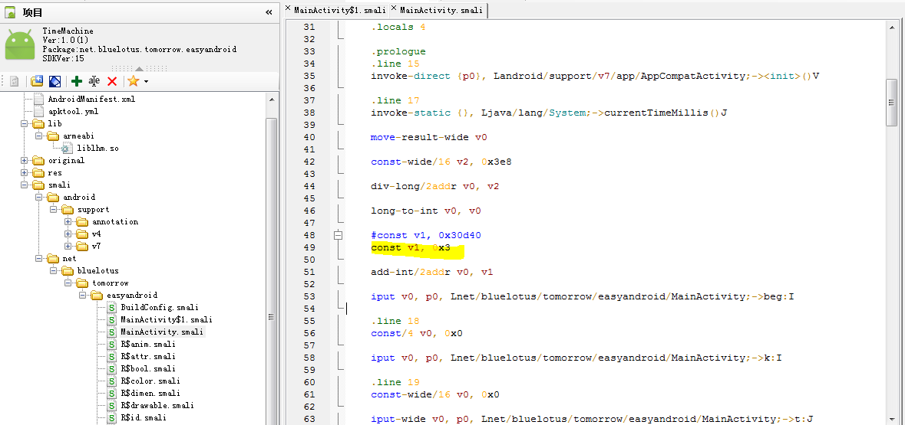

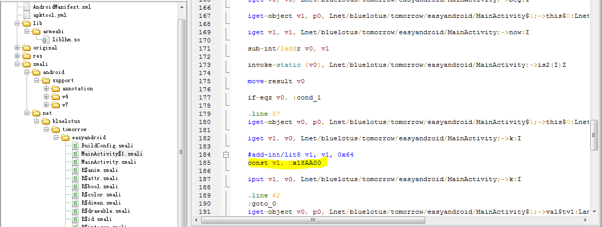

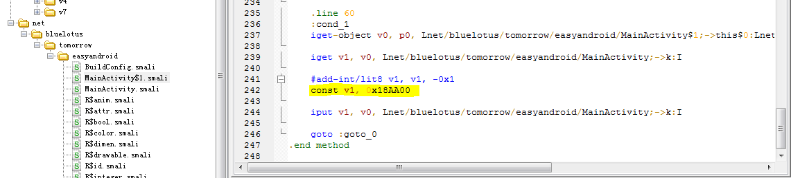

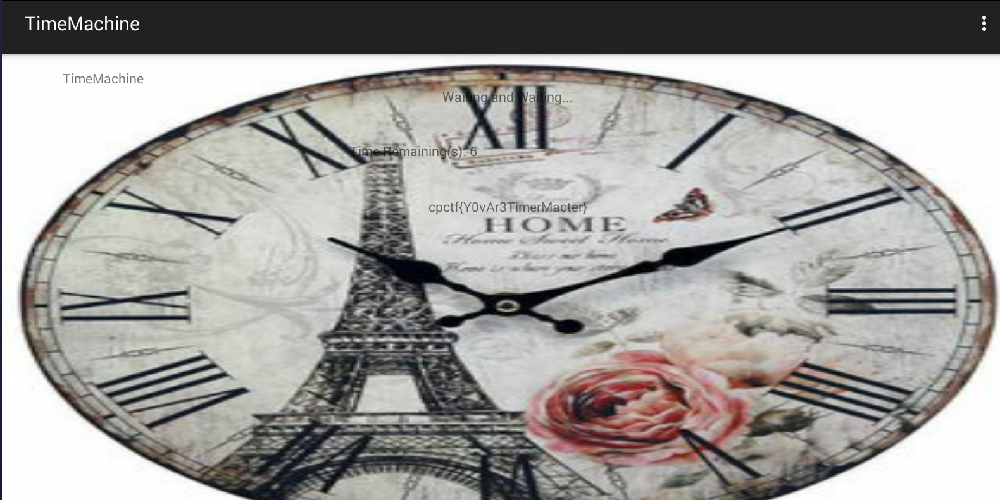

### so分析

TODO


