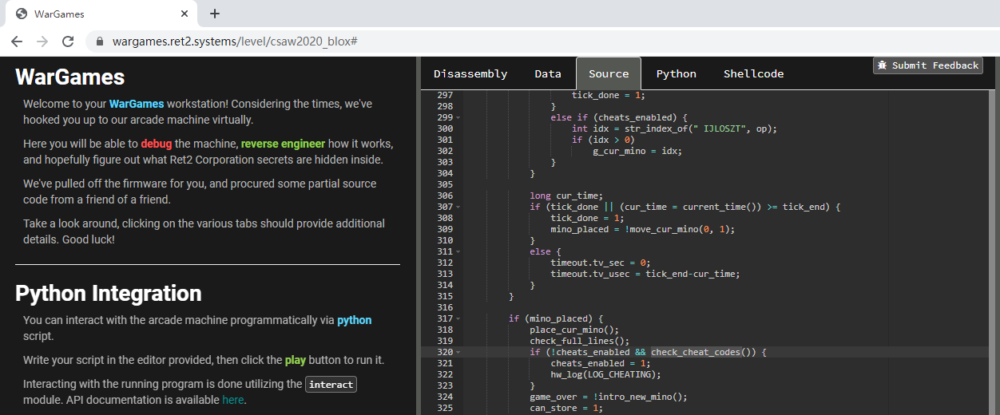
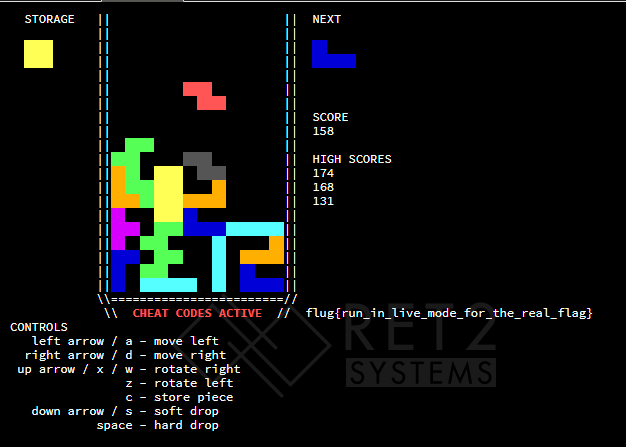

# CSAW_CTF_2020_blox1
## z3 solve
题目给了部分源代码，check_cheat_code函数没给源码，需要逆向分析

```
bool __cdecl check_cheat_codes()
{
  unsigned int blk; // [rsp+Ch] [rbp-4h]

  for ( blk = 0; blk <= 3; ++blk )
  {
    if ( !check_rows(blk) || !check_cols(blk) )
      return 0;
  }
  return 1;
}
unsigned int __cdecl check_rows(unsigned int blk)
{
  unsigned int x; // [rsp+8h] [rbp-Ch]
  unsigned __int8 sum; // [rsp+Eh] [rbp-6h]
  unsigned __int8 xor; // [rsp+Fh] [rbp-5h]
  unsigned int y; // [rsp+10h] [rbp-4h]

  for ( y = 0; y <= 4; ++y )
  {
    xor = 0;
    sum = 0;
    for ( x = 0; x <= 2; ++x )
    {
      if ( board[y + 15][3 * blk + x] )
      {
        xor ^= (_BYTE)x + 1;
        ++sum;
      }
    }
    if ( xor != rxors[blk][y] || sum != rsums[blk][y] )
      return 0;
  }
  return 1;
}
unsigned int __cdecl check_cols(unsigned int blk)
{
  unsigned int y; // [rsp+8h] [rbp-Ch]
  unsigned __int8 sum; // [rsp+Eh] [rbp-6h]
  unsigned __int8 xor; // [rsp+Fh] [rbp-5h]
  unsigned int x; // [rsp+10h] [rbp-4h]

  for ( x = 0; x <= 2; ++x )
  {
    xor = 0;
    sum = 0;
    for ( y = 0; y <= 4; ++y )
    {
      if ( board[y + 15][3 * blk + x] )
      {
        xor ^= (_BYTE)y + 1;
        ++sum;
      }
    }
    if ( xor != cxors[blk][x] || sum != csums[blk][x] )
      return 0;
  }
  return 1;
}
```
```python
from z3 import *
import sys

rxor = [
	[3, 2, 3, 2, 2],
	[0, 1, 3, 1, 0],
	[0, 2, 2, 2, 2],
	[0, 3, 0, 1, 0],
]
rsums = [
	[2, 2, 2, 2, 2],
	[3, 1, 2, 1, 3],
	[3, 1, 1, 1, 1],
	[3, 1, 3, 1, 3],
]
c_xor = [
	[1,2,3],
	[1,7,4],
	[1,1,1],
	[3,7,5]
]
c_sums = [
	[5,2,3],
	[5,3,2],
	[1,5,1],
	[4,3,4]
]

board = [ [ Bool('board_%d_%d' % (y,x)) for x in range(12) ] for y in range(5) ]

s = Solver()

for i in range(4):
	for y in range(0, 5):
		_xor = BitVecVal(0, 2)
		_sum = IntVal(0)
		for x in range (0, 3):
			_xor   = If(board[y][3*i + x], _xor ^ BitVecVal(x+1, 2), _xor)
			_sum = If(board[y][3*i + x], _sum+1, _sum)
		s.add(_xor == rxor[i][y])
		s.add(_sum == rsums[i][y])
	for x in range(0, 3):
		_xor = BitVecVal(0, 3)
		_sum = IntVal(0)
		for y in range (0, 5):
			_xor   = If(board[y][3*i + x], _xor ^ BitVecVal(y+1, 3), _xor)
			_sum = If(board[y][3*i + x], _sum+1, _sum)
		s.add(_xor == c_xor[i][x])
		s.add(_sum == c_sums[i][x])

print s.check()
m = s.model()

for y in range(5):
	for x in range(12):
		if str(m.eval(board[y][x])) == 'True':
			sys.stdout.write('#')
		else:
			sys.stdout.write(' ')
	sys.stdout.write('\n')
```
```
root@18:~/ctf/5# python test.py
sat
## #########
# ##   #   #
## ##  # ###
# ##   # #
# #### # ###
```
打游戏，使最后5行满足就行，游戏中可以按C置换一个（不能连续）

